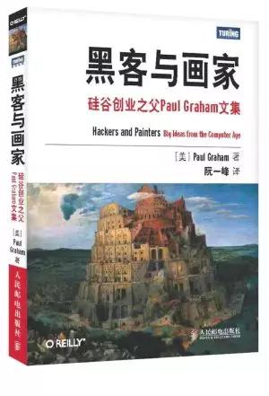

# Hackers-Painters-zh

《黑客与画家》中文翻译

在线阅读：[http://gdut_yy.gitee.io/doc-hp/](http://gdut_yy.gitee.io/doc-hp/)



## 目录

- [第 1 章 为什么书呆子不受欢迎](docs/ch1.md)
- [第 2 章 黑客与画家](docs/ch2.md)
- [第 3 章 不能说的话](docs/ch3.md)
- [第 4 章 良好的坏习惯](docs/ch4.md)
- [第 5 章 另一条路](docs/ch5.md)
- [第 6 章 如何创造财富](docs/ch6.md)
- [第 7 章 关注贫富分化](docs/ch7.md)
- [第 8 章 防止垃圾邮件的一种方法](docs/ch8.md)
- [第 9 章 设计者的品味](docs/ch9.md)
- [第 10 章 编程语言解析](docs/ch10.md)
- [第 11 章 一百年后的编程语言](docs/ch11.md)
- [第 12 章 拒绝平庸](docs/ch12.md)
- [第 13 章 书呆子的复仇](docs/ch13.md)
- [第 14 章 梦寐以求的编程语言](docs/ch14.md)
- [第 15 章 设计与研究](docs/ch15.md)

## 本地开发 & 阅读

本项目基于 vuepress 进行开发，以提供比 github mardown 更佳的阅读体验

依赖于 `node.js`、`yarn`、`vuepress` 等环境

```sh
# vuepress
yarn global add vuepress

# 本地开发
git clone https://github.com/gdut-yy/Hackers-Painters-zh.git
cd Hackers-Painters-zh/
yarn docs:dev

# 本地阅读
http://localhost:8080/doc-hp/
```

## 更多书籍

[https://github.com/xx-zh/xx-zh-roadmap](https://github.com/xx-zh/xx-zh-roadmap)

## License

[MIT](./LICENSE)
