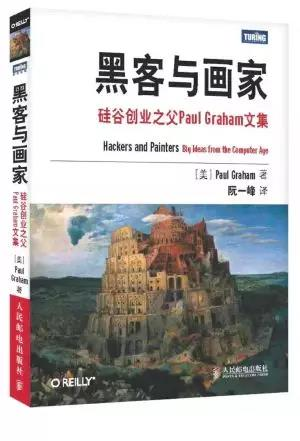

# 目录

- [第 1 章 为什么书呆子不受欢迎](ch1.md)
- [第 2 章 黑客与画家](ch2.md)
- [第 3 章 不能说的话](ch3.md)
- [第 4 章 良好的坏习惯](ch4.md)
- [第 5 章 另一条路](ch5.md)
- [第 6 章 如何创造财富](ch6.md)
- [第 7 章 关注贫富分化](ch7.md)
- [第 8 章 防止垃圾邮件的一种方法](ch8.md)
- [第 9 章 设计者的品味](ch9.md)
- [第 10 章 编程语言解析](ch10.md)
- [第 11 章 一百年后的编程语言](ch11.md)
- [第 12 章 拒绝平庸](ch12.md)
- [第 13 章 书呆子的复仇](ch13.md)
- [第 14 章 梦寐以求的编程语言](ch14.md)
- [第 15 章 设计与研究](ch15.md)
