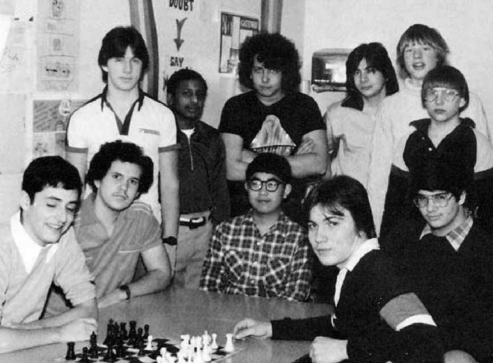

# 第 1 章 为什么书呆子不受欢迎

初中时，我和好友里奇画了一张学校食堂的餐桌分布图，每张桌子都标上了人气指数。这件事的难度并不高，因为选择坐在一起吃饭的人受瞩目程度往往都很接近。我们把所有桌子从 A 到 E 分成五等。坐在 A 桌的人不是校足球队的成员，就是啦啦队的成员。而 E 桌的好像都有一点轻微的唐氏综合症，那时我们管这种症状叫“弱智”。

我和里奇坐在 D 桌。一般来说，只要你不是外貌猥琐，这就是你能分到的最低档次的桌子了。我们把自己的桌子列为 D 桌，倒不是故意谦虚，而是无法自欺欺人。因为学校里每个人的级别都是明摆着的，我们想骗自己也骗不了。

我后来认识很多人，读书的时候都被称为书呆子。从他们身上我发现，“书呆子”与“高智商”有强烈的正相关关系。而这些人在中学里都是不受欢迎的学生，你越喜欢读书，就越不受别人的欢迎，因此“书呆子”和“受欢迎”之间，有一种更强烈的负相关关系。这样看来，“高智商”似乎导致了你不受欢迎。

为什么会这样？要是你眼下还在读中学，你一定会觉得这个问题很蠢。无可争议的事实就是，除了这样意外，似乎很难想象还能有什么别的结果。但是，的确会出现别样的情况。比如，在小学里，聪明的学生就没有受到排挤。再比如，毕业后踏上社会，聪明也不是一件坏事。而且，据我所知，在大多数国家，事情也没用如此严重。只有在典型的美国中学，做一个聪明的学生才是一件麻烦事，你的日子会很不好过。这究竟是为什么？

解开这个谜的关键是吧问题换一种提法。为什么聪明的小孩没有让自己变得受欢迎？如果他们真的很聪明，为什么找不到受欢迎的诀窍呢？他们在标准化测试中表现得这么好，为什么就不能再这方面也大获成功呢？

有一种观点认为，其他小孩妒忌聪明学生，所以聪明的学生不可能受到欢迎。我倒希望这种解释是对的。回想起来，要是初中里真的有人妒忌我，那么他们一定费了很大力气才把这种妒忌隐藏得无法发现。而且，在任何情况下，如果聪明真的令他人妒忌，这反而会招来女生。因为女生喜欢被其他男生妒忌的男生。

在我就读过的学校，聪明根本就是无足轻重的一样东西。同学们既不看重它，也不唾弃它。如果别的事情都相同，那么大家还是愿意自己变得聪明一点，因为这总比做个笨人好。但是总的来说，智力在大家心中的分量远远不如相貌、魅力和运动能力的分量重。

所以，如果智力本身与“受欢迎”无关，为什么聪明的小孩一直不受同龄人的欢迎呢？我认为，答案就是他们真的不想让自己受欢迎。

如果当时有人告诉我这个答案，我一定会嘲笑他。在学校里不受欢迎，你的日子就很难过，有人甚至因此自杀。所以，要是你跟我说，是我本人不想受欢迎，那就好比你在说，我再沙漠里快渴死了，却又不想喝水。别搞错了，让自己更受欢迎，这才是我要的。

但是事实上，我并不是那么强烈地渴望这个。我更想追求的是另一件事————聪明。这不仅仅意味着在学校得到好成绩（虽然某种程度上这也挺重要）。我真正想要的是，能够设计奇妙的火箭、写出漂亮的文章、理解编程原理。一句话，我想要做伟大的事情。

那时，我从没试过将梦想分门别类、一一排序。要是我做了，就会一眼看出聪明是排在最前面的。如果有人许诺，是我一举成为全校最受瞩目的学生，代价是从此智力平庸（请允许我在这里自命不凡），我是绝不会答应的。

虽然“书呆子”饱受不受欢迎之苦，但是为了解除痛苦而让他们放弃“聪明”，我想大多数人是不会愿意的。对他们来说平庸的智力是不可忍受的。不过，要是换了别的孩子，情况就不一样了，大多数人会接受这笔交易。对于很多人来说，这反而是更上一层楼的机会。即使是那些智力排名在前 20%的学生（我在这里假设智力可以测量，那时的人们似乎都相信这一点），谁不愿意用 30 分的成绩换来别人的友爱和钦佩？

我认为，这就是问题的根源。“书呆子”的目标具有两重性。他们毫无疑问想让自己受欢迎，但是他们更愿意让自己聪明。“受欢迎” 并不是你在课后时间随便做一做就能实现的，尤其是在美国的中学中，在这里，所有人为了个人魅力都会进行激烈竞争。

文艺复兴时期的代表人物阿尔伯蒂有一句名言：“任何一种艺术，不管是否重要，如果你想要在该领域出类拔萃，就必须全身心投入。”我很想知道，世界上是否还有人比美国的中学生在塑造个人魅力方面更加孜孜不倦、精益求精。相比之下，美国海军的海豹突击队（Navy SEALS）成员和神经外科的住院医生都成了懒汉。他们至少还有假期，有些人甚至还有业余爱好。但是，一个美国的青少年在醒着的每一分钟，都在琢磨怎样才能更受欢迎，一年 365 天，天天如此。

我并不是说这些青少年有一这样做。某些人确实是，小小年纪就成为了权谋家，但是大多数人不是。我在这里真正想要表达的是，青少年每时每刻都想融入群体之中。

举例来说，青少年往往很关注服饰。他们这样做并不是有意让自己赢得大众，他们的目的只是要穿得好看。但是穿给谁看呢？无非就是其他小孩。同伴的意见成为他们判别事物的标准，这不仅体现在衣着上，还体现在他们做的几乎每一件事情上，就连走路的姿势也不例外。所以，他们为了把所有事情“做对”，所付出的任何努力，不管是有意还是无意，实际上都等同于努力在使自己变得更受欢迎。

书呆子没有认识到这一点。他们没有认识到“受欢迎”需要付出如此之多的努力。一般来说，对于那些高度困难的领域，只有身处其中的人，才能意识到成功需要不间断（虽然未必是自觉的）付出。举例来说，大多数人似乎认为，绘画能力与生俱来，画家就像高个子一样，是天生的。事实上，大多数“会画”的人，本身就很喜欢画画，将许许多多时间投入其中，这就是为什么他们擅长画画的原因。同样的，受欢迎也不是天生的，而是要你自己做出来的。

    

图1-1 Gateway髙中的象棋俱乐部，1981年。左上角的人就是我 

书呆子不受欢迎的真正原因，是他们脑子里想着别的事情。他们的注意力都放在读书或者观察世界上面，而不是放在穿衣打扮、开晚会上面。他们就像头顶一杯水来踢足球，一边踢球，一边拼命保持不让水洒出来。其他人都在一门心思玩足球，遇到这样的对手，自然能够毫不费力地击败，并且心里还奇怪，对方怎么如此无能。

就算书呆子心里想着变得与其他小孩一样受欢迎，做起来确是难上加难。因为那些受欢迎的小孩，从小就在琢磨如何受欢迎，打心底里追求这个。但是，书呆子从小琢磨的却是如何更聪明，心底里也是这样追求的。这都是受父母的影响，书呆子被教导追求正确答案，而受欢迎的小孩被教导讨人喜欢。

到目前为止，我一直把“聪明的学生”和“书呆子”当做同义词，好像它们完全可以换着用。事实上，只有在我上面谈到的这种环境中才能这样使用。所谓“书呆子”，其实只是指这个人的社交能力不够强。但是，你到底需要多“强”的社交技能，取决于你所处的环境。在普通的美国学校中，成为“强人”的标准高得吓人（或者至少是十分特别），即使你不是很“呆”的人，相比之下，也只能算是呆子了。

仅有很少的聪明小孩，能够分配出足够的心思，去关心如何让自己受欢迎。他们往往碰巧还具有俊俏的外表、运动员的体格，或者受人瞩目的兄弟姐妹。不然的话，你就别无选择，只能成为书呆子了。这就是为什么聪明的小孩在青少年时期，比如 11 岁到 17 岁，有着一生中最糟的人生经历。人生的这个时期比其他任何时期更多地受到你受欢迎程度的影响。

11 岁以前，小孩的生活由家长主导，其他孩子的影响有限。孩子们不是不关心小学里其他同学的想法，但是后者不具有决定性影响。小学毕业以后，这种情形开始发生变化。

到了 11 岁左右，孩子们逐渐把家庭生活当做寻常事了。他们在同伴中开辟了一个新的世界，并认为那个世界才是重要的。实际上，如果他们在家里与父母发生冲突，反而能在那个新的世界中挣得面子，而他们也确实更在乎那个世界。

但是，问题在于，孩子们自己创造出来的世界是一个非常原始的世界。如果你听任一群 11 岁的孩子自行其是，最后就会发生小说《蝇王》中的情景。我同许多美国孩子一样，在学校里就被要求阅读此书。这可能不是巧合，有人可能希望借此向我们之处，我们这些孩子就是“野蛮人”，我们自己创造的世界是一个残酷和愚蠢的世界。对当时的我来说，领会这些意思有点太难了。虽然这本书读起来让人觉得完全可信，但是我一点儿没有读出文字背后的意思。当年，他们还不如直截了当告诉我们，我们这些孩子就是“野蛮人”，我们的世界愚不可及。

要是不受欢迎仅仅意味着不受到关注，书呆子们可能觉得还能忍受。不幸的是，在学校里不受欢迎等同于被歧视和被欺负。

为什么会被歧视和欺负？所有现在还在学校里读书的人可能会又一次觉得，怎么会有人问出这么蠢的问题。怎么可能会有其他结果。一般来说，成年人就不会去欺负书呆子。为什么小孩子会这样做呢？

一部分原因是，青少年在心理上还没有摆脱儿童状态，许多人都会残忍地对待他人。他们觉得折磨书呆子和拔掉一条蜘蛛腿一样好玩。在一个人产生良知之前，折磨就是一种娱乐。

孩子们欺负书呆子的另一个原因是为了让自己感到好受一些。当你踩水的时候，你把水踩下去，你的身体就会被托起来。同样，在任何社会等级制度中，那些对自己没自信的人就会通过虐待他们眼中的下等人来突显自己的身份。我已经意识到，正是因为这个原因，在美国社会中底层白人是对待黑人最残酷的群体。

但是我认为，孩子们欺负书呆子的主要原因业余追求“受欢迎”的心里有关。怎样才能让他自己更受欢迎？个人魅力知识很小的一方面，你应该更多地考虑如何结盟。秘诀就是不停地设法使自己与其他受欢迎的人变得关系更密切。没有什么比一个共同的敌人更能使得人们团结起来了。

这就好比一个政客，他想让选民忘记糟糕的国内局势，方法就是为国家找出一个敌人，哪怕敌人并不真的存在，他也可以创造一个出来。一群人在一起，挑出一个书呆子，居高临下地欺负他，就会把彼此联系起来。一起攻击一个外人，所有人因此就都成了自己人。这就是为什么最恶劣的倚强凌弱的事件都与团体有关的原因。随便找一个书呆子，他都会告诉你，一群人的虐待比一个人的虐待残酷得多。

如果其中还有一丝安慰，那就是书呆子不妨记住，这种虐待不是针对个人的。一群孩子成群结伙地欺负你，那并不是因为你做错了什么，而是因为这一伙人需要找一件事一起干，这就好像一群人成群结伙地去打猎一样。他们实际上并不恨你，他们只是需要一个共同的目标。

因为书呆子是不受欢迎的，处在学校的底层，所以全校学生都把书呆子当作一个可供欺负的安全目标。如果我没记错的话，最受欢迎的孩子并不欺负书呆子，他们不需要靠踩在书呆子身上来垫高自己。大部分的欺负来自处于下一等级的学生，那些焦虑的中间层。

麻烦的是，这样的人数量庞大。受欢迎的学生的分布并不是金字塔形的，而是像一个倒放的梨子，底部逐渐收窄。最不受欢迎的人数相当少。（我相信，在我们画的餐桌分布图中，称得上 D 桌的，只有我所在的那一桌。）所以，想要欺负书呆子的人比被欺负的书呆子多得多。

与不受欢迎的小孩保持距离，可以为你加分；那么与他们关系密切，就会为你减分。我认识的一位女性说，他在高中时对书呆子有好感，但是害怕被人看到她与书呆子说话，因为其他女孩会因此取笑她。不受欢迎是一种传染病，虽然善良的孩子不会去欺负书呆子，但是为了保护自己，也依然会与书呆子保持距离。

难怪聪明的小孩读中学时往往是不快乐的。他们有其他的兴趣，没有多余的精力用来使自己更受欢迎。你在其他地方有所得，就会在这个地方有所失。不受欢迎使得书呆子成为全校攻击的目标。令人惊奇的是，这种噩梦般的情景并非出自任何有预谋的恶意，而仅仅因为这个特殊的环境。

对我而言，最糟糕的日子是初中。孩子们内部的世界刚刚形成，一切都很严酷，聪明的孩子与普通的孩子，人与人之间的差异慢慢开始显露。几乎每一个和我讨论过的人都同意，人生的最糟糕时期是在 11 岁到 14 岁。

在我读的学校，八年级的时候（也就是我 12~13 岁的那一年）曾经发生过一件一起轰动的事情。有一个老师在等校车的时候，偶然听到一群女生在议论某个书呆子如何被欺负，她深感震惊，第二天就向全班发表了言辞恳切的呼吁，请大家不要如此残忍地对待同学。

她的呼吁并没有产生实际的效果。那时，最触动我的是，她居然对这件事感到震惊。这是不是意味着她以前对此一无所闻？她觉得这一切是不正常的？

没错，成年人不知道孩子们内部发生的事。认识到这一点很重要。在抽象意义上，成年人知道孩子的行为有时是极端残酷的，这正如我们在抽象意义上知道贫穷国家的人民生活极端艰难。但是，像所有人一样，成年人不喜欢揪住不放这种令人不快的事实。你不去埋头探寻，就不会发现具体的证据，就会永远以为这件事是抽象的。

公立学校的老师很像监狱的狱卒。看管监狱的人主要关心的是犯人都待在自己应该待的位置。然后，让犯人有东西吃，尽可能不要发生斗殴和伤害事件，这就可以了。除此之外，他们一件事也不愿多管，没必要自找麻烦。所以他们就听任犯人内部形成各种各样的小集团。根据我读到的材料，犯人内部的关系是扭曲、野蛮、无孔不入的。处在这种人际关系的最底层可不是好玩的事。

总体上看，我就读的学校与上面说的监狱差不多。校方最重视的事情，就是让学生待在自己应该待的位置。与此同时，让学生有东西吃，避免公然的暴力行为，接下来才是尝试教给学生一些东西。除此之外，校方并不愿意在学生身上多费心思。就像监狱的狱卒，老师们很大程度上对学生是放任自流的。结果，学生就像犯人一样，发展出了野蛮的内部文化。

可是，为什么离开学校以后，真实的世界却能友好地对待书呆子呢？答案似乎很简单，因为那是成年人的世界，他们都成熟了，不会把书呆子挑出来欺负。不过，我觉得这不是主要答案。监狱里的成年人不也照样以强凌弱吗？而且很显然，上层社会的阔太太之间也是如此，在曼哈顿的某些地方，女性之间的交往听起来就像高中时代的延续，同样充满了各种算计和勾心斗角。

我认为，真实世界的关键并非在于它是由成年人组成的，而在于它的庞大规模使得你做的每件事都能产生真正意义上的效果。学校、监狱、上流社会的女士午餐会，都做不到这一点。这些场合的成员都好像关在封闭的泡沫之中，所作所为只对泡沫内部有影响，对外部没有影响。那么很自然地，这些场合就会产生野蛮的做法。因为他们不具备实际功能，所以也就无所谓采用的形式。

当你所做的事情能产生真实的效果，那就不仅仅是好玩而已了，发现正确的答案就开始变得重要了，这正是书呆子的优势所在。你马上就能联想到比尔·盖茨。他不善于交际是出了名的，但是他发现了正确的答案，至少从收入上看是如此。

真实世界的特点是，它极其庞大。如果总体足够大，即使是人数最少的少数派，只要聚在一起，也能产生可观的力量。在真实世界中，书呆子在某些地方聚集起来，形成自己的社区，智力因素成为那里最被看重的东西。有时，这种因素甚至会以相反的形式表现出来，特别实在大学的数理学系，书呆子甚至会夸大笨拙，以显示自己的聪明。约翰·纳什非常钦佩诺伯特·维纳，就学维纳的样子，经过走廊的时候都用手扶着墙走路。

我 13 岁的那一年，对世界的全部认识，就是身边看到的一切。我以为，我所经历的种种扭曲的事件就是世界的样子。看上去这是一个残酷的世界，也是一个乏味的世界，我不太肯定哪一个更糟一些。

因为我再这个世界中过得并不好，我觉得一定是自己什么地方做错了。我没有意识到，作为书呆子，我不适应周围环境，某种程度上正说明我领先了一步。书呆子已经在思考的东西，正是真实世界看着的东西。他们与别人不一样，不把所有时间用来玩一种耗尽全力但又毫无意义的游戏。

我们的感受，有点像一个被重新塞进中学的成年人。他不知道穿什么衣服，听什么音乐，用什么暗语。在别的孩子眼里，他就像一个彻头彻尾的外星人。不过成年人很清楚不用在乎别人怎么想，我们就没有这种自信了。

许多人似乎认为，聪明的小孩在人生的这个阶段应该与“正常的”小孩待在一起。也许吧。但是，至少在某些情况中，书呆子感到布氏硬度真正原因是其他人都是疯子。我记得读高中的时候，有一次在体育馆观看校运动会的出征大会，啦啦队把对手的模拟像扔到看台上，观众一哄而起，把他撕成碎片。我感到自己仿佛是一个探险家，正在目睹某种奇特的部落仪式。

如果能回到过去，我会向 13 岁的我提供一些建议，主要告诉他要昂起头看世界。我在那个年纪根本不知道这一点，而我身边的世界又虚假得像奶油夹心蛋糕一样。不仅是学校，整个小镇都很虚假，不像真实的世界。为什么人们要搬到郊区去住？为了养育下一代！难怪郊区生活是如此地乏味和贫瘠。整个镇子就像一个巨大的幼儿园，所有的一切都是为了教育下一代而有意识地造出来的。

在我生长的这个地方，感觉整个世界就是这么大，你根本没有别的地方可去，没有别的事情可做。这一点都不令人意外。郊区就是故意这样设计的，与外部世界隔离，不让儿童沾染到外界有害的东西。

至于学校，不过是这个虚假环境中关住牲口的围栏。表面上，学校的使命是教育儿童。事实上，学校的真正目的是把儿童都关在同一个地方，以便大人们白天可以腾出手来把事情做完。我对这一点没有意见，在一个高度工业化的社会，对孩子不加管束，让他们四处乱跑，无疑是一场灾难。

让我困扰的，不是把孩子关在监狱里，而是（a）不告诉他们这一点，（b）把这监狱的大部分教给犯人来管理。孩子们被送进来，花 6 年时间，记住一些毫无意义的事实，还要身处在一个由四肢发达的小巨人管理的世界，那些巨人们只知道追逐一个椭圆形的，棕色的球，好像这是全世界最天经地义的事情。这简直就像一场超现实的鸡尾酒化妆晚会，如果孩子畏缩不前，瑟瑟发抖，他们就会被视为怪人。

生活在这个扭曲的世界，不仅仅对书呆子，对所有孩子来说，都是充满压力的。就像任何一场战争，胜利方也是要付出代价的。

成年人肯定不可避免地看到了孩子们在受苦受难。他们为什么不做点什么呢？因为他们认为那是青春期在作祟。成年人对自己说，孩子们不快乐的原因是因为他们身体内部出现了大量的化学物质——激素。激素在血液中奔流，把所有事情都搞得一团糟。整个社会系统一点问题都没有，孩子们到了这个年纪，不可避免地会感觉很糟糕。

这种看法无所不在，甚至孩子们自己都相信了。但是相信这种话可能一点帮助也没有。你告诉一个人，他的脚天生就是坏的，并不能阻止他去怀疑他可能穿错了鞋子。

我就不太相信这种理论，凭什么说 13 岁的小孩自己有问题。如果这是激素过多的生理问题，那就应该普遍存在。可是，蒙古的游牧民族在 13 岁时难道也是这么空虚吗？我读过许多历史资料，找不到任何一条 20 世纪之前的历史事实支持这个理论上应该普遍存在的现象。文艺复兴时期的很多青少年学徒看上去过得很开心很投入。当然，他们彼此之间也有争斗和阴谋诡计（米开朗琪罗小时候就曾经被其他小孩打断过鼻子），但是他们并不疯狂。

就我所知，青少年因为激素而行为失常的理论与美国中产阶级迁至郊区的进程是同步出现的。我认为这不是巧合，青少年是被迫去过这种生活的，他们是被逼疯的。文艺复兴时期的学徒是整天劳碌的牧羊狗，而今天的青少年则是神经兮兮、供人玩耍的哈巴狗。他们的疯狂源于到处都是一片可怕的无聊。

我读中学的时候，自杀是聪明学生中永恒的话题，虽然在我认识的人当中没有人真的自杀，但是不少人有这样的设想，其中一些人可能还真的尝试过。对于大多数人来说，自杀只是一个姿态。就像其他青少年一样，我们都喜欢有戏剧效果，而自杀看上去就非常富有戏剧性。但是也有部分原因是因为我们的生活真的很悲惨。

被其他小孩欺负只是问题的一部分。还有别的问题存在，甚至可能是更糟的问题。那就是我们没有得到真正的工作，没能发挥我们的才能。人类喜欢工作，在世界上大多数地方，你的工作就是你的身份证明。但是，我们那时做的所有事情根本就是无意义的，至少那时看来是这样。

最好的情况下，那些事情也不过是遥远的将来我们可能从事的实际工作的练习。他所面向的目标是如此遥远，以至于当时我们都不知道自己练习这些到底是为了干什么。更常见的情况是，那些事情不过是一系列随意设置的绳圈，你被要求一个个跳过去。你在学习中遇到的文字都是专为考试而设计的，目的就是为了出题，而不是为了讲清楚问题。（南北战争的三个主要原因是··· ··· 等到考试的时候，就会有一道题：请列出南北战争的三个主要原因。）

而且，没有办法回避那些事情。成年人已经达成共识，认定通往大学的途径就是这样的。逃离这种空虚生活的唯一方法，就是向它屈服。

过去的社会中，青少年扮演着一个更积极的角色。工业化时代到来前，青少年都是某种形式的学徒，不是在某个作坊，就是在在某个村庄，甚至在某艘军舰上。他们不会被扔到一边，创造自己的小社会。他们是成年人社会的低级成员。

以前的青少年似乎也更尊敬成年人，因为成年人都是看得见的专家，会传授他们所要学习的技能。如今的大多数青少年，对他们的家长在遥远的办公室所从事的工作几乎一无所知。他们看不到学校作业与未来走上社会后从事的工作有何联系（实际上，还是有那么一点点联系）。

如果青少年跟尊重成年人，那么成年人也会更接受青少年。经过几年的训练，学徒就能担当更重要的职责。即使是那些刚招收进来的学徒，也能用来送信或打扫场地。

如今的成年人根本不接受青少年。一般来说，他们都是在办公室工作，所以就在上班的路上，顺路把孩子送到学校去关着，这有点像他们周末外出度假时，把狗送到寄养的地方。

与此同时，社会发生了什么变化？我们被迫面对一个更严峻的问题。它与当前的其他许多难题有着共同的起因，那就是“专业化”（specialization）。当工作的专业程度越来越高时，我们就必须接受更长时间的训练。工业化时代来临之前，儿童最晚大约在 14 岁就要参加工作，如果是在农庄（那个时代大多数人生活在农村），参加工作的时间就更早。如今，只要一个青少年读大学，他就要等到 21 岁或 22 岁才开始全职工作。如果有更高的学位，比如医学博士或哲学博士，可能要拖到 30 岁才能完成学业。

当今的青少年在生产活动中，根本就是毫无用处的。他们只能在诸如快餐店这样的地方充当廉价劳动力，而快餐店也看出来了，充分利用了这个事实。对于除此以外的几乎所有行业，青少年都会带来净损失。但是，他们又太年轻，不能放任不管，必须有人看着他们。最有效的解决方案，就是把他们集中在一个地方，用几个成年人看守所有小孩。

如果事情只发展到这一步，那么我们就是在描述一个监狱，唯一的区别就是这个监狱不是全日制的。问题在于，许多学校实际上真的停留在这一步。学校的使命据称是教育儿童，但是并没有外在的压力监督他们把这件事做好。所以，大多数学校的教学质量都很糟糕，孩子们根本不把学习当回事，就连认真读书的孩子也是如此。许多时候，我们所有人——包括学生和老师——都只是做做样子，走过场而已。

我在高中上法语课的时候，课程内容包括阅读雨果的长篇小说《悲惨世界》。我觉得，学生中不可能有人的法语水平高到可以自己读懂这本巨著。所以，像班上的其他人一样，我参考了 Cliff's Notes 的导读本。后来，学校有一次专门针对《悲惨世界》的测验，我发现里面的问题都很奇怪，到处都是很长的单词，老师上课时从没有用过这些词。这些题目是从哪里来的？原来也是出自 Cliff's Notes。老师们也在使用这个导读本，我们双方都在敷衍了事。

公立学校肯定也有很优秀的老师。我读四年级时遇到的 Mihalko 老师就是一个精力充沛、充满想象力的老师。他使得那个学年如此令人难忘，以至于三十年后，他的学生依然在谈论这段往事。但是，像他这样的老师只是个别现象，无法改变整个体系。

几乎所有在任何团体中都存在等级关系。成年人在真实世界中形成的团体，一般来说，都存在某个共同目标，团体的领导者往往由最善于实现目标的人担任。学校就不一样，大多数情况下，学生内部形成的团体没有一个共同目标。但是，等级关系却不会缺席，所以孩子的等级是凭空创造出来的。

我们有一个专门的短语描述这种情况，即在没有任何严肃标准的前提下，产生排名的情况。我们会说情况“倒退至人缘比赛”（degenerates into a popularity contest）。这正是大多数美国学校中发生的事情。某个人的排名不是根据他的真正能力，而主要根据他专供排名的能力。这就像路易十四的宫廷。没有外在的对手，孩子们就互相把对方当做对手。

如果存在对于真正能力的外部测试，待在等级关系的底层也不会那么痛苦。球队的新人并不会怨恨老队员的球技，他希望有一天自己也能如此，所以很高兴有机会向老队员求教。老队员可能也会因此产生一种传帮带的光荣感（noblesse oblige）。最重要的是，老队员的地位是通过他们本身出色的能力获得的，而不是通过排挤他人获得的。

宫廷中的等级关系就完全是另一回事了。这种类型的团体贬低了每一个成员的人格。底层成员对上层成员毫无敬意，而上层成员也没有传帮带的光荣感。这里的一切就是杀与被杀的关系。

美国中学学生的内部，就是这种关系的社会。因为除了每天把小孩聚集在某个地方，关上几个小时以外，学校并没有其他的真实目的，所以学生内部形成这种关系也就很自然了。我当时并没有意识到，直到不久前才恍然大悟，校园生活的两大恐怖之处——残忍和无聊——也是出于同样的原因。

美国公立学校的平庸并不仅仅是让学生度过了不快乐的六年，还带来了严重后果。这种平庸直接导致学生的叛逆心理，使他们远离那些原本应该要学习的东西。

许多书呆子可能都与我一样，直到高中毕业多年后，才去读中学里的指定读物。但是，我错过的绝不仅仅只是几本书而已。我对许多美好的字眼都嗤之以鼻，比如“人格”、“正直”，因为成年人贬低了这些词。在他们嘴里，这些词似乎都是同一个意思——“听话”。一些孩子因为具备所谓的“人格”和“正直”，而受到夸奖，可是他们不是呆的像一头大笨牛，就是轻浮得像一个不动脑筋的吹牛者。如果“人格”和“正直”就是这种样子，我宁愿不要它们。

我误解最深的一个词就是“老成”（tact）。成年人使用这个词，含义似乎就是“闭上嘴巴，不要说话”。我以为它与“缄默”（tacit）和“不苟言笑”（taciturn）有着相同的词根，字面意思就是安静。我就是对自己发誓，我绝不要变成“老成”的人，没有人能够让我闭上嘴巴。可是事实上，这个词的词根语“触觉”（tactile）相同，他真正的意思是熟练的碰触。“老成”的反义词是“笨拙”（clumsy）。进入大学以后，我才搞明白了这个词。

在这场激烈的人缘争斗中，书呆子并不是唯一输家。他们不受欢迎，只是因为他们分心去干别的事了。还有一些孩子则是主动放弃，因为他们对这个过程感到厌恶。

青少年都不喜欢孤独一人，即使具有叛逆心理的青少年也是如此。所以，当他们选择退出这个系统时，他们往往会一群人一起退出。在我读过的学校，叛逆心理的主要焦点在于毒品的使用，尤其是大麻。这帮孩子穿着黑色的演唱会 T 恤，被称为“怪人”（freak）。

怪人和书呆子属于同一个联盟，他们之间有很多相同之处。虽然在怪人的群体中，绝不学习是一个很重要的价值观（至少看上去如此），但是从整体上看，怪人还是比其他孩子聪明。我本人更多地属于书呆子阵营，但是我有很多怪人朋友。

怪人使用毒品，是为了建立他们之间的社交纽带，至少一开始如此。因为毒品是非法的，所以一起用的话，就创造了一种共同反叛的标志。

我在这里并不是说糟糕的学校教育是孩子使用毒品的唯一原因。只要你碰过毒品，一段时间以后，毒品就会自行推动你的行为。而且毫无疑问，有些怪人使用毒品的根本原因是为了逃避其他问题，比如家庭问题。但是，至少在我的学校，大部分孩子使用毒品的主要原因是出于叛逆心理。14 岁的孩子开始抽大麻，并不是因为他们听说这样有助于忘记烦恼，而是因为他们想要加入一个不同的团体。

不当的管制导致叛逆，这并不是新鲜事。即使毒品本身就是麻烦的来源，学校本身依然无法推卸主要责任。

校园生活的真正问题是空虚。除非成年人意识到这一点，否则无法解决这个问题。可能意识到这个问题的成年人，是那些读书时就是书呆子的人。你想让你的孩子读八年级的时候和你一样不快乐吗？我可不想。那好，有什么事是我们可以做的？肯定有的。现行体系中没有什么事是必然的。它是现在这个样子，大部分是因为没人去改变它。

你也许会说，成年人很忙。观看孩子在学校的文艺表演是一回事，着手改革教育制度又是另一回事。可能只有少数人由精力从事改革工作。那么我要说，我觉得最难的部分，其实是能否意识到你该做什么。

还在学校里读书的书呆子不应该屏息凝神，等着全副武装的成年人某一天乘直升飞机从天而降来拯救你。也许会有这么一天，但是肯定不会很快到来。任何对生活立竿见影的改变，可能还是来自于书呆子自己。

哪怕你什么也改变不了，但是仅仅是理解自己的处境，也能使得痛苦减轻一些。书呆子并不是失败者。他们只是在玩一个不同的游戏，一个更接近于真实世界状况的游戏。成年人明白这一点。成功的成年人，几乎都声称自己在高中属于书呆子。

对于书呆子来说，意识到学校并非全部的人生，也是很重要的事情。学校是一个很奇怪的、人为设计出来的体系，一半像是无菌室，一半像是野蛮洪荒之地。它就像人生一样，里面无所不包，但又不是事物的真实样子。它只是一个暂时的过程，只要你向前看，你就能超越它，哪怕现在你还是身处其中。

如果你觉得人生糟透了，那不是因为体内激素分泌失调（你父母相信这种说法），也不是因为人生真的糟透了（你本人相信这种说法）。那是因为你对成年人不再具有经济价值（与工业社会以前的时期相比），所以他们把你扔在学校里，一关就是好几年，根本没有真正的事情可做。任何这种类型的组织都是可怕的生存环境。你根本不需要寻找其他的原因就能解释为什么青少年是不快乐的。

我在这篇文章中发表了一些刺耳的意见，但是我对未来是乐观的。我们认定无法解决的难题，事实上完全可以解决。青少年并不是洪水猛兽，也并非天生就不快乐。这一点对于青少年和成年人，应该都是令人鼓舞的消息。
