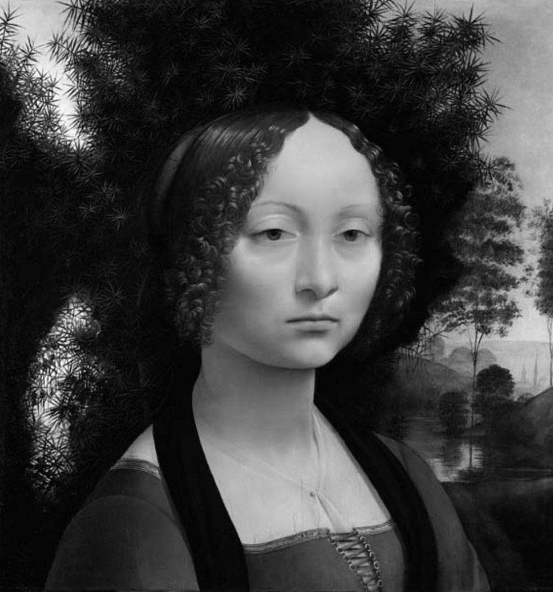
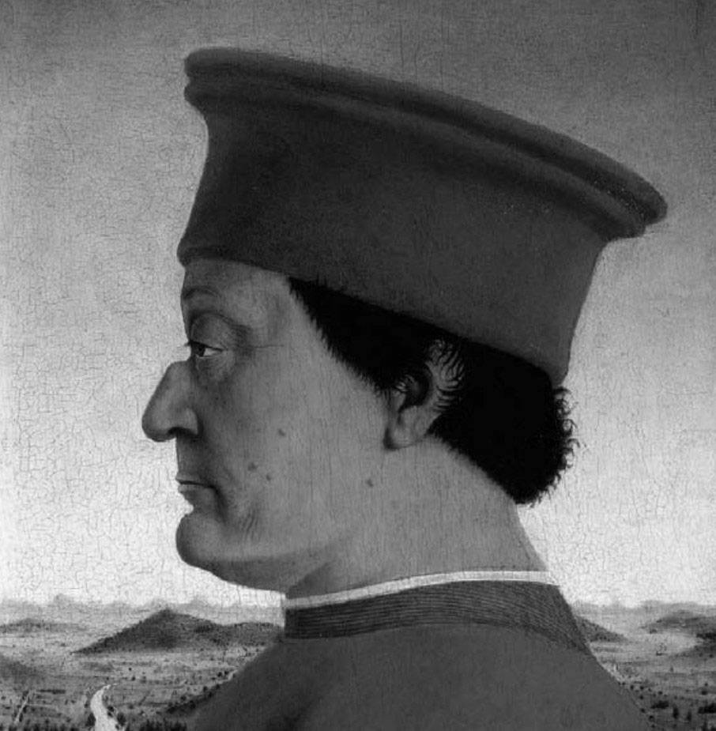

# 第 2 章 黑客与画家

读完计算机系的研究生，我就去了艺术学校，学习绘画。许多人很吃惊：一个喜欢计算机的人，居然还喜欢画画！他们似乎觉得，摆弄计算机和画画是两件截然不同的事情——计算机是冰冷的、精确的、井然有序的，而画画是某种原始欲望热烈狂放的表达方式。

这种看法是错的。计算机和画画有许多共同之处。事实上，在我知道的所有行业中，黑客与画家最相像。

黑客与画家的共同之处，在于他们都是创作者。与作曲家、建筑师、作家一样，黑客和画家都是试图创作出优秀的作品。他们本质上都不是在做研究，虽然在创作过程中，他们可能会发现一些新技术（那样当然更好）。

我一直不喜欢“计算机科学”（computer science）这个词。主要原因是根本不存在这种东西。计算机科学就像一个大杂烩，由于某些历史意外，很多不相干的领域被强行拼装在一起。这个学科的一端是纯粹的数学家，他们自称“计算机科学家”，只是为了得到国防部研究局（DARPA）的项目资助。中间部分是计算机博物学家，研究各种专门性的题目，比如网络数据的路由算法。另一端则是黑客，只想写出有趣的软件，对于他们来说，计算机只是一种表达的媒介，就像建筑师手里的混凝土，或者画家手里的颜料。所以，在“计算机科学”的名下，数学家、物理学家、建筑师都不得不待在同一个系里。

有时，黑客做的事情被称为“软件工程”（software engineering），但是这个词也是误导的。与其说优秀的软件设计师是工程师，还不如说是建筑师。建筑学和工程学之间的区别并不是很严格的，但就是存在区别。这表现在“做什么”和“怎么做”：建筑师决定做什么，工程师想出怎么做。

当然，“做什么”和“怎么做”不应该分得太开。如果你决定做一件事，却不知道怎么做，你就是在自找麻烦。但是，只是单纯地决定如何实现某种规格，那肯定不是黑客。黑客的最髙境界是创造规格。虽然看起来，做到这一点的最好方法就是先做出一个样品把规格实现了。

也许有一天，“计算机科学”分裂成几个独立的部分。这可能是一件好事，如果我本人的领域——黑客——能够独立出来，那就更好了。

把不同类型的工作捆绑在一起，可能是为了行政管理的方便，但是却容易引起混淆。这是我不喜欢“计算机科学”这个词的又一个原因。中间部分“计算机科学家”的工作，也许还可以被称为计算机的实验科学。但是，两端的数学家和黑客，并不是在做计算机的科学研究。

数学家看来并不在乎自己搞的是计算机还是数学。他们很高兴来到这个新地方，然后就开始埋头证明新的定理，与数学系的数学家干的事情完全一样。不一会儿，他们可能就忘了办公楼外的牌子上写的是“计算机科学系”。但是对于黑客，“计算机科学”这个标签是一个麻烦。如果黑客的工作被称为科学，这会让他们感到自己应该做得像搞科学一样。所以，大学和实验室里的黑客，就不去做那些真正想做的事情（设计优美的软件），而是觉得自己应该写一些研究性的论文。

要是黑客写论文，最好的情况下，写出来的也只是一些补充性的描述，不会具有太大的实际价值。黑客先开发了一个很酷的软件，然后就写一篇论文，介绍这个软件。论文变成了软件成果的展示。这种结合是错误的，常常会产生问题。为了配合论文研究性的主题，你很容易就把工作重点从开发优美的软件转移为开发一些丑陋的东西。

优美的软件并不总是论文的合适题材。首先，科学研究必须具有原创性。写过博士论文的人都知道，确保自己正在开垦新领地的方法，就是去找那些没有人要的土地。其次，科学研究必须是能够产生大量成果的，而那些不成熟的、障碍重重的领域最容易写出许多篇论文，因为你可以写那些为了完成工作、你不得不克服的障碍。没有什么比一个错误的前提更容易产生大量待解决的问题了。人工智能（AI）领域的大部分情况，都符合这条“如何凭空创造出问题”的规律。如果你假定，使用一系列的谓词逻辑（predicate logic）表达式，再加上代表抽象概念的参数，就能表达人类的知识，那么，你就可以写出许许多多的论文，解释如何完成这项工作。这就像电视剧《我爱露西》（I Love Lucy）的男主角 Ricky Ricardo 的话：“露西，这下够你好好解释的了。”

创造优美事物的方式往往不是从头做起，而是在现有成果的基础上做一些小小的调整，或者将已有的观点用比较新的方式组合起来。这种类型的工作很难用研究性的论文表达。

那么，为什么大学和实验室还把论文数量作为考核黑客工作的指标呢？这种事情其实在日常生活中普遍存在，比如，我们使用简单的标准化测试考核学生的“学术能力倾向”（scholastic aptitude），再比如，我们使用代码的行数考核程序员的工作效率。这样的考核容易实施，而容易实施的考核总是首先被采用。

黑客真正想做的是设计优美的软件，考核这种工作是非常困难的。你本人需要有良好的设计感，才能去考核别人的设计是否良好。但是，你觉得你有“良好的设计感”，与你实际是否具有，不存在相关关系，甚至可能存在负相关。

唯一有效的外部考核就是时间。经过岁月的洗礼，优美的东西生存发展的机会更大，丑陋的东西往往会被淘汰。不幸的是，这种考核需要的时间可能比一个人的生命还要长。塞缪尔·约翰逊说过，人们对一个作家的评价，需要 100 年才能达成一致。你必须先等他的那些有影响力的朋友都死了，然后再等他的追随者都死了，才能对他有一个公正的评价。

我想，名望有很大的随机性，黑客对此只好听天由命了。在这一点上，他们与其他创作者并无不同。事实上，相比而言，他们还是幸运的。暂时性的、一窝蜂式的时代风潮对画家的影响要比对黑客的影响大得多。

人们无法考核你的工作，甚至误解你的工作，都不是最糟的事。更大的危险是你自己也会误解自己的工作。因为你总是从相关领域寻找新思想，如果你发现自己读的是计算机科学系，很自然地，你就会以为“计算机科学”与其他“理论科学”并无不同，你的工作属于“理论计算机科学”所涉及的那种理论的应用研究。读研究生期间，我潜意识里一直有一种很不舒服的感觉，觉得自己应该多学一点理论，不应该期末考试结束还不到三个星期，就把所有东西忘得一干二净，那样真是不可饶恕。

现在，我意识到自己错了。黑客搞懂“计算理论”（theory of computation）的必要性，与画家搞懂颜料化学成分的必要性差不多大。一般来说，在理论上，你需要知道如何计算“时间复杂度”和“空间复杂度”（time and space complexity）；如果你要写一个解析器，可能还需要知道状态机（state machine）的概念；除此以外，并不需要知道特别多的理论。这些可比画家必须记住的颜料成分少很多。

我发现，黑客新想法的最佳来源，并非那些名字里有“计算机”三个字的理论领域，而是来自于其他创作领域。与其到“计算理论”领域寻找创意，你还不如在绘画中寻找创意。

举例来说，我在大学受到的教育是，在上机编程之前，应该先在纸上把程序搞清楚。可我自己一直不是这样编程的，我喜欢直接坐在计算机前编程，而不是在纸上编程。更糟的是，我不是耐心地一步步写出整个程序，确保大体上是正确的，而是一股脑不管对错，先把代码堆上去，再慢慢修改。书上说，调试（debugging）是最后的步骤，用来纠正打字的错误和疏忽。可是我的工作方法看上去却像编程就是在调试。

很长一段时间内我都为此事沮丧，就像小学里老师教我怎么拿铅笔，我却总是学不会的那种感觉。如果我那时看到其他创作领域，比如绘画或者建筑，我就会想到，自己的方法其实有一个正式的名称：打草稿。我现在认为，大学里教给我的编程方法都是错的。你把整个程序想清楚的时间点，应该是在编写代码的同时，而不是在编写代码之前，这与作家、画家和建筑师的做法完全一样。

明白这一点对软件设计有重大影响。它意味着，编程语言首要的特性应该是允许动态扩展（malleable）。编程语言是用来帮助思考程序的，而不是用来表达你已经想好的程序。它应该是一支铅笔，而不是一支钢笔。如果大家都像学校教的那样编程，那么静态类型（static typing）是一个不错的槪念。但是，我认识的黑客，没有一个人喜欢用静态类型语言编程。我们需要的是一种可以随意涂抹、擦擦改改的语言，我们不想正襟危坐，把一个盛满各种变量类型的茶杯，小心翼翼放在自己的膝盖上，为了与一丝不苟的编译器大婶交谈，努力地挑选词语，确保变量类型匹配，好让自己显得礼貌又周到。

创作者不同于科学家，明白这一点有很多好处。除了不用为静态类型烦恼以外，还可以免去另一个折磨科学家的难题，那就是“对数学家的妒忌”。科学界的每一个人，暗地里都相信数学家比自己聪明。我觉得，数学家自己也相信这一点。最后的结果就是科学家往往会把自己的工作尽可能弄得看上去像数学。对于物理学这样的领域，这可能不会有太大不良影响。但是，你越往自然科学的方向发展，它就越成为一个严重的问题。

一页写满了数学公式的纸真是令人印象深刻啊。（小窍门：用希腊字母表示变量名会令人印象更深刻。）因此，你就受到巨大的诱惑，去解决那些能够用数学公式处理的问题，而不是去解决真正重要的问题。

如果黑客认识到自己与其他创作者——比如作家和画家——是一类人，这种诱惑对他就不起作用。作家和画家没有“对数学家的妒忌”，他们认为自己在从事与数学完全不相关的事情。我认为，黑客也是如此。

如果大学和实验室不允许黑客做他们想做的事情，那么适合黑客的地方可能就是企业。不幸的是，大多数企业也不允许黑客做他们想做的事情。大学和实验室强迫黑客成为科学家，企业强迫黑客成为工程师。

直到最近我才发现这一点。雅虎收购 Viaweb 的时候，他们问我想做什么。我对商业活动从来都没有太大兴趣，就回答说我想继续做黑客。等我来到雅虎以后，发现在他们看来，“黑客”的工作就是用软件实现某个功能，而不是设计软件。在那里，程序员被当作技工，职责就是将产品经理的“构想”（如果这个词是这么用的话）翻译成代码。

这似乎是大公司的普遍情况。大公司这样安排的原因是为了减少结果的标准差。因为实际上只有很少一部分黑客懂得如何正确设计软件，公司的管理层很难正确识别到底应该把设计软件的任务交给谁。所以，大部分公司不把设计软件的职责交给一个优秀的黑客，而是交给一个委员会，黑客的作用仅仅是实现那个委员会的设计。

如果某一天你想要去赚大钱，那么记住上面这一点，因为这是创业公司能够成功的原因之一。大公司为了避免设计上的灾难，选择了减少设计结果的标准差。但是当你排斥差异的时候，你不仅将失败的可能性排除在外，也将获得高利润的可能性排除在外。这对大公司来说不是问题，因为生产特别优秀的产品不是它们的获胜手段。大公司只要做到不太烂，就能赢。

所以，如果你的竞争优势是在软件设计方面，并且你的对手是一家大公司，它大到由一群产品经理来设计软件，那么你的对手将永远无法赶上你。不过说实话，这样的机会不容易找到。你很难单单依靠软件设计就与大公司展开竞争。这就好比你很难攻入城堡与对手面对面地徒手搏斗。比如，就算写一个比微软的 Word 更好的文字处理软件不是难事，但是微软公司有自己的城堡，它的操作系统是垄断的，你根本无法对它构成威胁，它甚至都不会注意到你的存在。

真正竞争软件设计的战场是新兴领域的市场，这里还没有人建立过防御工事。只要你能做出大胆的设计，由一个人或一批人同时负责设计和实现产品，你就能在这里战胜大公司。微软公司自己一开始就是这样走向成功的，苹果公司和惠普公司也是如此。我觉得几乎所有的创业公司都是这样取得成功的。

所以，开发优秀软件的方法之一就是自己创业。但是，这样做会遇到两个问题。一个是自己开公司的话，必须处理许许多多与开发软件完全无关的事情。我创立 Viaweb 的时候，如果有四分之一时间可以用于开发，就感到很幸运了。我在其他四分之三时间所做的事情，从单调乏味到惊悚恐怖，无所不包。我来说一个比较，有一次董事会开到一半，我不得不离开去补牙。我记得坐在牙医诊所的椅子上，等着医生开动牙钻的那段时间，与刚才待在公司的时间相比，简直感觉像是在度假一样。

创业的另一个问题是赚钱的软件往往不是好玩的软件，两者的重叠度不髙。设计编程语言是很好玩的事情，事实上，微软的第一个产品就是一种编程语言。但是，如今没有人会出钱买编程语言。如果你想赚钱，你可能不得不去干那些很麻烦很讨厌的事情，因为这些事情没人愿意义务来干。

所有创作者都面临这个问题。价格是由供给和需求共同决定的。好玩的软件的需求量，比不上解决客户麻烦问题的软件的需求量。在小剧场里演出的酬劳，比不上穿着卡通大猩猩服装、在展览会上为厂商站台的酬劳。写小说的回报比不上写广告文案的回报。开发编程语言的收入，比不上把某些公司老掉牙的数据库连上服务器的收入。

黑客如何才能做自己喜欢的事情？我认为这个问题的解决方法是一个几乎所有创作者都知道的方法：找一份养家糊口的“白天工作”（day job）。这个词是从音乐家身上来的，他们晚上表演音乐，所以白天可以找一份其他工作。更一般地说，“白天工作”的意思是，你有一份为了赚钱的工作，还有一份为了爱好的工作。

几乎所有的创作者在职业生涯的早期都有一份“白天工作”。画家和作家尤其显著。如果幸运的话，你能找到一份与你的“真正工作”非常相关的“白天工作”。音乐家似乎常常是在唱片行工作。同样地，钻研某种编程语言或操作系统的黑客，很可能会得到一份使用这些工具的“白天工作”。

当我说，黑客解决生计问题的方法是找一份“白天工作”，然后在其余时间开发优美的软件，我并没有说这是一个新方法。开源软件界的黑客早就这样做了。我想说的其实是，幵源软件的这种工作模式可能就是正确的模式，因为它已经被其他领域的创作者都验证过了。

令我惊讶的是，雇主都很犹豫，不愿意手下的黑客为开源软件项目工作。但是，在 Viaweb，要是你不愿意这样干，我们会很犹豫要不要雇用你。我们面试程序员的时候，主要关注的事情就是业余时间他们写了什么软件。因为如果你不爱一件事，你不可能把它做得真正优秀，要是你很热爱编程，你就不可避免地会开发你自己的项目。

因为黑客更像创作者，而不是科学家，所以要了解黑客，不应该在科学家身上寻找启示，而是应该观察其他类型的创作者。那么，从画家身上，我们还能借鉴到什么对黑客的启示呢？

有一件事情是可以借鉴的（至少可以确认），那就是应该如何学习编程。画家学习绘画的方法主要是动手去画，黑客学习编程的方法也理应如此。大多数黑客不是通过大学课程学会编程的，他们从实践中学习，13 岁时就自己动手写程序了。即使上了大学，黑客学习编程依然主要通过自己写程序。

画家的作品都会保留下来，你观察这些作品，就能看出他们是怎么一步步通过实践学习绘画的。如果你把一个画家的作品按照时间顺序排列，就会发现每幅画所用的技巧，都是建立在上一幅作品学到的东西之上。某幅作品如果有特别出色之处，你往往能够在更早的作品上发现一个小规模的初期版本。

我想大多数创作者都是这样学习和工作的，作家和建筑师似乎都是如此。也许对于黑客来说，采取像画家这样的做法很有好处：应该定期地从头开始，而不要长年累月地在一个项目上不断工作，并且试图把所有的最新想法都以修订版的形式包括进去。

黑客通过实践学习编程，这又是一个标志，说明黑客与科学家的区别有多大。科学家就不会通过干活来学习科学，而是通过做实验和解题来学习。科学家研究的基础都是现有的很完美的成果，在这个意义上，他们的第一步只是在复制别人已经做过的工作。最后，他们才会从某一个点开始，进行自己的原创性工作。但是，黑客就不一样，从一幵始做的就是原创性工作，根本没有他人完美的成果可以依靠。所以，黑客的出发点是原创，最终得到一个优美的结果；而科学家的出发点是别人优美的结果，最终得到原创性。

创作者另一个学习的途径是通过范例。对画家来说，博物馆就是美术技巧的图书馆。几百年来，临蓽大师的作品一直是传统美术教育的一部分，因为临摹迫使你仔细观察一幅画是如何完成的。

作家也是这样学习写作的。富兰克林（Benjamin Franklin）通过总结和模仿艾迪生和斯梯尔的文章，学会了写作。雷蒙·钱德勒（Raymond Chandler）也是如此学会了写作侦探小说。

同样地，黑客可以通过观看优秀的程序学会编程，不是看它们的执行结果，而是看它们的源代码。开源运动最鲜为人知的优点之一，就是使得学习编程变得更容易了。我学编程的时候，不得不主要依靠教材上的范例。那时可以搞到的源码，主要来自于 Unix，但是就连 Unix 也不是开源的。大部分阅读 Unix 源码的人都是通过约翰·莱昂斯那本书的非法影印本。该书虽然是 1977 年写的，但是在 1996 年之前都不被允许公开出版。

还有一个可以借鉴绘画的地方：一幅画是逐步完成的。通常一开始是一张草图，然后再逐步填入细节。但是，它又不单纯是一个填入细节的过程。有时，原先的构想看来是错的，你就必须动手修改。无数古代油画放在 X 光下检视，就能看出修改痕迹，四肢的位置被移动过，或者脸部的表情经过了调整。

绘画的这个创作过程就值得学习。我认为黑客也应该这样工作。你不能盼望先有一个完美的规格设计，然后再动手编程，这样想是不现实的。如果你预先承认规格设计是不完美的，在编程的时候，就可以根据需要当场修改规格，最终会有一个更好的结果。

（大公司的内部结构，使得它们很难这样做。这是又一个创业公司占优之处。）

眼下想必每个人都知道，过早优化（premature optimization）是一件危险的事情。我认为，我们应该对“过早设计”（premature design）也抱有同样的担忧，不要太早决定一个程序应该怎么做。

合适的工具能够帮助我们避免这种危险。一种好的编程语言，应该像油画颜料一样，能够使得我们很从容地改变想法。动态类型语言在这一点上就是蠃家，因为你不必提前就设置好各种变量的数据类型。不过我认为，编程语言灵活性的关键还不在这里，而在于这种语言应该非常抽象。最容易修改的语言就是简短的语言。

我接下来要说的是，一幅优秀的绘画作品必须比它应该有的样子更好，这可能听起来有点矛盾。举例来说，图 2-1 所示达·芬奇的作品《女性肖像》（Ginevra de' Benci）现在保存在美国国家美术馆。你可以看到，达·芬奇在少女的头后面摆了一片树枝。他很仔细地画出了树枝上的每一片叶子。许多画家也许会觉得，那不过是放在背景里的衬托物，没有人会仔细看的，不妨简单处理一下就可以了。

    

图2-1 达·芬奇的《女性肖像》（Ginevra de' Benci），1474年

但是达·芬奇不这样想。他对作品每一部分的认真程度完全不取决于预料中会不会有人仔细看这个部分。他就像篮球巨星迈克尔·乔丹（Michael Jordan），每一球都一丝不苟，绝不降低对自己的要求。

坚持一丝不苟，就能取得优秀的成果。因为那些看不见的细节累加起来，就变得可见了。当人们从达·芬奇的《女性肖像》前面走过的时候，他们的注意力往往立刻就被它吸引住了，那时他们甚至还没有看到说明的标签牌，没有意识到这是达·芬奇的作品。所有那些看不见的细节合并在一起，就使得这样东西产生了惊人的效果，仿佛上千个细微的声音都以同一个音调在歌唱。

同样地，优秀的软件也要求对美的狂热追求。如果你查看优秀软件的内部，就会发现那些预料中没有人会看见的部分也是优美的。我对待代码的认真程度远远超过我对待其他事情，如果我以这种态度对待日常生活的每件事，那么我就够资格找心理医生开处方药了。看到代码前面的缩进乱七八糟，或者看到丑陋的变量名，都会把我逼疯的。

如果黑客只是一个负责实现领导意志的技术工人，职责就是根据规格说明书写出代码，那么他其实与一个挖水沟的工人是一样的，从这头挖到那头，仅此而已。但是，如果黑客是一个创作者，他从事的就不是机械性的工作，他必须具备灵感。

黑客就像画家，工作起来是有心理周期的。有时候，你有了一个令人兴奋的新项目，你会愿意为它一天工作 16 个小时。等过了这一阵，你又会觉得百无聊赖，对所有事情都提不起兴趣。

为了做出优秀的工作，你必须把这种心理周期考虑在内。只有这样，你才能根据不同的事情找出不同的应对方法。你有一辆手动变速的汽车，你把它开上山，有时不得不松开离合器，防止汽车熄火。同样，暂时放手有时也能防止热情熄火。对于画家和黑客这样的创作者，有些工作需要投入巨大的热情，另一些工作则是不需要很操心的日常琐事。在你厌倦的时候再去做那些比较容易的工作，这是个不错的主意。

对于编程，这实际上意味着你可以把 bug 留到以后解决。消灭 bug 对我来说属于轻松的工作，只有在这个时候，编程才变得直接和机械，接近社会大众想象中的编程的样子。消灭 bug 的过程就像解一道数学题，已知许许多多的约束条件，你只要根据条件对方程求解就可以了。你的程序应该能产生 x 结果，但是却产生了 y 结果。哪里出错了？你知道自己最后肯定能解决这个问题，所以做起来就很轻松，就好像刷墙一样，接近于休闲了。

用绘画的例子作为参考，不仅能教会我们如何管理自己的工作，还能教会我们如何与他人一起工作。历史上许多伟大的艺术品都是多人一起合作的结果，尽管最后在博物馆展出的时候，墙上可能只会写出一个人的名字。达·芬奇曾经在韦罗基奥（Verrocchio）的画室当学徒，后者当时正在画《基督的洗礼》（Baptism of Christ），达·芬奇的工作是完成整幅画之中的一个天使。多人一起完成一幅作品是当时的普遍做法，并不罕见。后来，米开朗基罗坚持要一个人画完罗马的西斯廷大教堂（Sistine Chapel）天顶壁画中的所有人物，他还因此被认为特别死心眼。

就我所知，当多个画家共同创作一幅作品时，每个人画的部分都是不一样的。通常来说，大师负责画主要人物，助手们负责画次要人物和背景。但是，你肯定找不到某个部分是两个人一起画的。

我认为，这也是多人共同开发一个软件的正确模式。需要合作，但是不要“合”得过头。如果一个代码块由三四个人共同开发，就没有人真正“拥有”这块代码。最终，它就会变得像一个公用杂物间，没人管理，又脏又乱，到处堆满了冗余代码。正确的合作方法是将项目分割成严格定义的模块，每一个模块由一个人明确负责。模块与模块之间的接口经过精心设计，如果可能的话，最好把文档说明写得像编程语言规范那样清晰。

就像绘画作品一样，大多数软件是为人类用户准备的。所以，黑客必须像画家一样，时刻考虑到用户的人性需要，这样才能做出伟大的产品。你必须能够站在用户的角度思考问题，也就是说你必须学会“换位思考”。

很小的时候，我就被不断告知，要设身处地为他人着想。现实中，这必然意味着你要做其他人需要的事情，而不是你自己想做的事情。这样看上去好像对我很不利，所以我暗下决心不让自己变成这样的人。

但是，我完全错了。事实表明，从他人的角度思考问题正是成功的奥秘所在。“换位思考”并不就意味着你要做自我牺牲。实际上，这是完全不同的两回事。了解别人对于事情的看法，并不代表你为他的利益服务。某些情况下，比如打仗的时候，了解对手正是为了打击对手。

大多数创作者都是为人类用户而创作。为了吸引用户，你必须理解用户需要什么。举例来说，几乎所有最伟大的绘画作品都是画人的，因为人类总是对自身感兴趣的。

普通黑客与优秀黑客的所有区别之中，会不会“换位思考”可能是最重要的单个因素。有些黑客很聪明，但是完全以自我为中心，根本不会设身处地为用户考虑。这样的人很难设计出优秀软件，因为他们不从用户的角度看待问题。

判断一个人是否具备“换位思考”的能力有一个好方法，那就是看他怎样向没有技术背景的人解释技术问题。我们大概都认识这样一些人，他们在其他方面非常聪明，但是把问题解释清楚的能力却惊人低下。如果聚会上，外行人问他们“什么是编程语言”，他们会这样回答：“哦，高级语言就是编译器的输入代码，用来产生目标码。”高级语言？编译器？目标码？……如果对方不知道什么是编程语言，那么他显然也不会知道这些概念。

软件的部分功能就是解释自身。为了写出优秀软件，你必须假定用户对你的软件基本上一无所知。你要明白，用户第一次使用你的软件的时候，不会预先做好功课，他们没有任何准备就开始用了，所以软件的使用方式最好能符合用户的直觉，别指望用户去读使用手册。在这方面，我见过的最佳系统是 1984 年原始的 Macintosh 电脑。它做到了那时别的软件都做不到的事情：它真的能用。

源代码也应该可以自己解释自己。如果我只能让别人记住一句关于编程的名言，那么这句名言就是《计算机程序的结构与解释》一书的卷首语：

> 程序写出来是给人看的，附带能在机器上运行。

“换位思考”不仅是为了你的用户，也是为了你的读者。这对你是有利的，因为你也会读自己写的东西。许多黑客六个月后再读自己的程序，却发现根本看不懂它是怎么运行的。我认识好几个人，因为这种经历而发誓不再使用 Perl 语言。

在某些地方，自行其道、完全不替读者着想，被看成是高水平、高智商的表现，甚至都发展成了一种风尚。但是，我不觉得“换位思考”与智商之间存在任何联系。在数学和自然科学领域，你不用学习怎么向别人表达自己，也能取得很好的成就。而那些领域的人普遍很聪明，所以人们很自然地就把“聪明”与“不懂得换位思考”联系了起来。但是，世界上还有许许多多很笨的人，也同样不懂得“换位思考”。

最后，如果编程是与绘画和写作同一类的工作，黑客是否有机会像伟大艺术家一样备受推崇、流芳后世呢？毕竟生命只有一次，你可能想用它来做一些伟大的事情。

很遗憾，这个问题很难回答。声望这个东西，总是经过漫长的时滞以后才会确立，它就像遥远星系发出的光，经过了许多光年才能被我们看到。那些如今声名显赫的绘画作品，来自于五百年前的画家的卓越工作。在那些画家生前，没人像我们今天那样看重这些作品。1465 年的人们也许会感到非常奇怪，后世的人们提起乌尔比诺城（Urbino）不可一世的费德里科公爵，最主要的原因居然是弗朗切斯卡把他的鼻子画得非常独特（见图 2-2）。

    

图2-2 皮埃罗·德拉·弗朗切斯卡（Piero della Francesca）的作品《蒙特费特罗家族的费德里科》（Federico da Montefeltro），1465～1466年（局部）

所以，虽然我必须承认，眼下看来艺术家比黑客更酷，但是我们不应忘记，古时候绘画蓬勃发展的那些黄金年代，画家也不是像今天这样酷的。

我们能够有把握说的就是，现在正是编程的黄金年代。大多数领域的伟大作品都诞生于很早以前。1430 年到 1500 年之间的绘画杰作，至今仍然是不可超越的。莎士比亚出现的时候，戏剧这种文艺体裁才刚发展起来，专门表演戏剧的场所“戏院”才刚刚诞生。他把戏剧这种艺术形式提升到一个难以触及的高度，让后世的每一个剧作家都不得不生活在他的阴影之中。德国雕塑大师丢勒（Albrecht Dürer）、英国小说家简·奥斯丁（Jane Austen）都是这样的大师。

我们看到这种模式一再反复出现。一种新的媒介刚刚诞生的时候，人们热情髙涨、兴奋不已，短短几代人就探索清楚了这种媒介的大部分可能性，把它的能量发挥到极致。编程目前好像就处在这个阶段。

在达·芬奇的年代，绘画并不是一件很酷的事情，达·芬奇用自己的工作推动绘画成为一种伟大的表达方式。同样，编程到底能够有多酷，取决于我们能够用这种新媒介做出怎样的工作。
