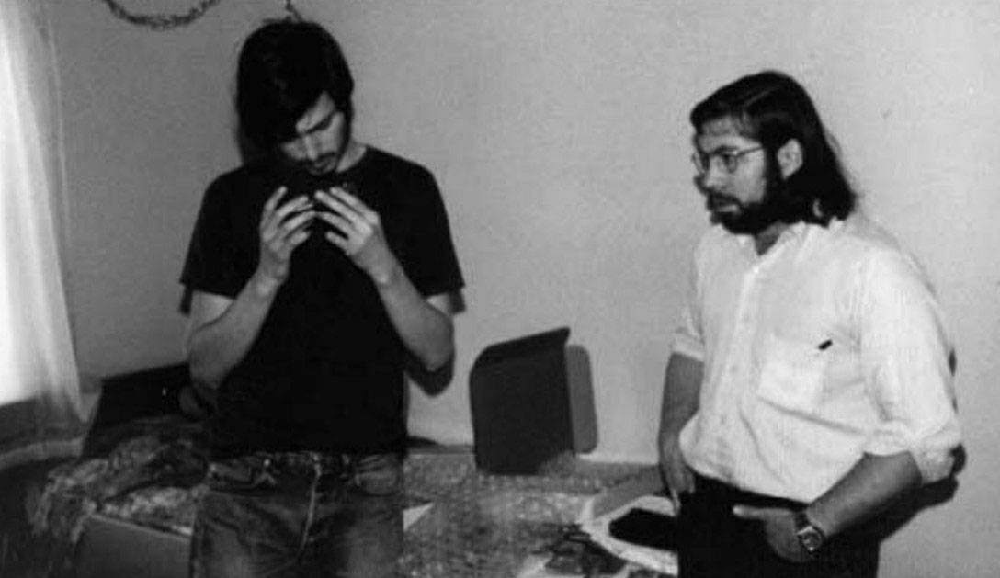

# 第 4 章 良好的坏习惯

在大众眼里，“黑客”（hacker）就是入侵计算机的人。可是，在程序员眼里，“黑客”指的是优秀程序员。这两个含义其实是相关的。对于程序员来说，“黑客”这个词的字面意思主要就是“精通”，也就是他可以随心所欲地支配计算机。

更麻烦的是，“黑”（hack）这个词也有两个意思，既可以用作赞美，也可以用作羞辱。如果你解决问题的方式非常丑陋笨拙，这叫做你很“黑”。如果你解决问题的方式非常聪明高超，将整个系统操纵在股掌之间，这也叫做你很“黑”。日常生活中，前一种意思更多见，可能因为丑陋的做法总是多于聪明的做法。

信不信由你，“黑”的这两个意思也是相关的。丑陋的做法与聪明的做法存在一个共同点，那就是都不符合常规。你用胶带把包裹绑在自行车上，那是不符合常规的丑陋做法；你提出充满想象力的新概念，推翻欧几里德空间（Euclidean space），那是不符合常规的聪明做法。从“丑陋”到“聪明”，它们之间存在一种连续性渐变。

早在计算机出现之前，黑客就存在了。费曼为曼哈顿计划工作时，喜欢破解存放机密文件的保险箱，觉得这样很有趣。这种传统持续至今。读研究生时，我有一个黑客朋友，他费尽心力配齐了一整套的开锁工具（现在，他在管理一个对冲基金，那个行业与开锁并非毫无关系。）。

有时，你很难向当局解释为什么有人喜欢做这种事。我的另一个朋友，曾经因为入侵计算机，受到了政府的调查。最近，这种行为已经被认定为一种犯罪，但是联邦调查局发现，通行的调査方法不适用于黑客。警方总是从犯罪动机开始调查。常见的犯罪动机不外乎毒品、金钱、性、仇恨等。满足智力上的好奇心并不在 FBI 的犯罪动机清单之上。说实话，这个概念对他们来说完全陌生。

总体来看，黑客是不服从管教的，这往往会激怒管理当局。但是，不服从管教，其实是黑客之所以成为优秀程序员的原因之一。当公司的 CEO 装模作样发表演说时，他们可能会嘲笑他；当某人声称某个问题无解时，他们可能也会嘲笑他。如果硬要他们服从管教，他们也就无法成为优秀程序员了。

不过，有些人的这种态度不是真的，而是装出来的。某些年轻程序员注意到了知名黑客的怪癣，就会模仿，好使自己显得更聪明。这种装出来的不服从再加上故作姿态挑毛病的态度，不仅仅令人恼火，而且实际上会延缓创新的进程。

但是，即使考虑到黑客令人恼火的种种怪癖，他们不服从管教的性格依然是利大于弊。我希望人们能理解，能更多地看到这种性格的长处。

举例来说，好莱坞的电影人一直大惑不解，为什么黑客不喜欢版权法。在黑客网站 Slashdot 上面，版权是永恒的讨论热点。为什么程序员那么关心版权，而不是其他事情？

部分原因是，有些公司为了防盗版而使用了禁止复制的技术。这等于交给黑客一把锁，他的第一反应肯定是如何才能打开它。但是，这里面还有更深层次的原因，对于版权和专利这样的制度，黑客深感担忧。他们感到，保护“知识产权”的力度不断增大，已经威胁到了他们完成工作所必需的“思想自由”。在这一点上面，他们的看法是正确的。

只有深入了解当前的技术，黑客才能构想下一代技术。知识产权的拥有者也许会说，不，谢谢，我们不需要你的帮助，我们自己就能开发下一代技术。他们错了，在计算机工业的历史上，新技术往往是由外部人员开发的，而且所占的比例可能要高于内部人员。1977 年，IBM 公司内部肯定有一些部门正在开发下一代电脑。他们没有料到的是，真正的下一代电脑不是诞生于 IBM 实验室，而是由两个与他们完全不相干的长头发年轻人在旧金山的一间车库里开发出来的。这两个年轻人，一个是史蒂夫·乔布斯，另一个是史蒂夫·沃兹尼亚克（图 4-1）。差不多同一时间，计算机工业的几大巨头聚在一起，合作研发官方版的下一代操作系统 Multics。但是，另外两个年轻人——26 岁的肯·汤普森和 28 岁的丹尼斯·里奇——觉得 Multics 过分复杂，就另起炉灶，写出了一个自己的操作系统。他们参照 Multics，为它取了一个搞笑式的名字 Unix。

    

图4-1 1975年，乔布斯和沃兹尼亚克 

最新的版权法设置了前所未有的障碍，禁止外部人员了解专有技术的内部细节，从而也就禁止了外部人员从这个途径产生新构想。过去，厂商使用专利，防止你出售他们产品的复制品，但是他们无法阻止你把产品拆开，了解内部的工作原理。最新的版权法将后面的这种行为定义为一种犯罪。如果我们不可以研究当前的技术，不能思考如何改进它，那么我们怎样才能开发出新技术呢？

具有讽刺意味的是，这种局面正是黑客自己造成的。计算机是《版权法》修改的根本原因。历史上，机器内部的控制系统一直是物理装置:齿轮、杠杆和连接器等。但是，计算机的出现使得机器的控制系统逐渐变成了软件，产品的价值也由软件来决定。我这里所说的软件是一个统称，包括数据（data）在内。胶木唱片上的歌曲属于数据，是用物理方法压制在塑料盘片上的；iPod 里的歌曲也属于数据，它储存在硬盘里面。

数据在本质上就是容易复制的。互联网的出现使得复制品更容易流通。难怪那些公司感到害怕了。但是，如同往常一样，恐惧影响了他们的判断。他们推动政府通过了严厉的法律，保护知识产权，作为对新技术的回应。立法者的原意可能是好的。但是，他们也许没有意识到，这样的法律弊大于利。

为什么程序员如此激烈地反对这样的法律？如果我是立法者，肯定对这种神秘现象有兴趣。这就好比如果我是一个农夫，半夜突然听到鸡舍有动静，肯定会去看个究竟。黑客都是聪明人，很少出现所有人意见一致的情况。如果他们都说有问题，那么也许真的就是什么地方出了问题。

那些法律有没有可能是错的？虽然它们原意是维护美国的利益，但是实际上却适得其反？想一想吧，理查德·费曼喜欢破解保险箱，真的很符合美国人性格。很难想象，当时的德国政府会有同样的幽默感。也许这不是巧合。

黑客是不服从管教的，这就是他们的本性。这也是美国人的本性。硅谷出现在美国，而不是出现在法国、德国、英国、日本，这绝非偶然。后面那些国家的人们总是按部就班地行事。

我曾经住在意大利的佛罗伦萨。住了几个月以后，我发现自己内心真正寻找的地方其实是我刚刚离开的地方。佛罗伦萨之所以著名，完全是因为这个城市在 1450 年的显赫地位，它是那时的纽约，形形色色疯狂而有抱负的人们来到这里。现在，这样的人都去了美国。（所以，我又回到了美国。）

对于适当的不服从管教，保持宽容不会有太大的坏处，反而很有利于美国的国家优势，它使得美国不仅能吸引聪明人，还能吸引那些很自负的人。黑客永远是自负的。如果黑客有自己的节日，那就是 4 月 1 日愚人节，你可以放心地作弄其他人。黑客的这种自行其是的特点，很大程度上说明了，为什么不管是出色的工作还是糟透了的工作，黑客都用同一个词形容。如果他们做出了一个东西，他们自己总是无法百分百确定那到底是什么东西。有可能完全没用，但是只要那些出错的地方还算正常，那么就是一个信号，表明这个东西还有希望。在人们心目中，编程是非常精确、有条不紊的，这真是非常奇怪的想法。计算机确实是非常精确、有条不紊的，但是黑客的所作所为完全出于兴趣，想到哪里就做到哪里，没有明确的计划，只求开心。

在黑客世界中，有些最典型的解决问题的方法实际上与玩笑也相差不远。IBM 推出个人电脑的时候，懒得自己开发操作系统，就与微软公司签了一个很大方的授权协议，将微软的 DOS 作为默认操作系统，每卖出一台电脑，微软都可以提成，并且还可以把 DOS 授权给其他公司使用。这份授权协议的结果无疑让 IBM 感到非常吃惊。另一个例子是 Michael Rabin 遇到难题的时候，会把问题重新定义成一个较简单的形式，同时一定会假想一个对手正在与他比赛谁能更快地解决问题。

很自负的人必须培养出敏锐的感觉，及时发现周围情势的变化，知道怎样才能脱身。最近，黑客就感觉不太对，大气候变了。对于不服从管教，政治气氛变得严厉了。

近来一系列的政策变化，使得这个国家的公民自由范围不断收缩减小。对于黑客来说，这是非常不好的兆头。普通人肯定会感到大惑不解，为什么黑客如此在乎公民自由？为什么程序员会比牙医、销售员、园艺师更在乎呢？

让我以政府官员听得懂的语言来解释这件事情。公民自由并不仅仅是社会制度的装饰品，或者一种很古老的传统。公民自由使得国家富强。如果将人均国民生产总值与公民自由的关系画成图，你会发现它们是很清楚的正相关关系。公民自由真的是国家富强的原因，而不是结果吗？我认为是的。在我看来，一个人们拥有言论自由和行动自由的社会，往往最有可能采纳最优方案，而不是采纳最有权势的人提出的方案。专制国家会变成腐败国家，腐败国家会变成贫穷国家，贫穷国家会变成弱小国家。经济学里有一条拉弗曲线（Laffer curve），认为随着税率的上升，税收收入会先增加后减少。我认为政府的力量也是如此，随着对公民自由的限制不断上升，政府的力量会先增加后减小。至少现在看来，我们的政府很可能蠢到会真的把这个实验付诸实施，亲自验证一下这个观点。但是，税率提高了还能再降下来，而一旦这个实验铸成大错，就悔之晚矣，因为极权主义制度只要形成了，就很难废除。

这就是为什么黑客感到担忧。政府侵犯公民自由，表面上看，并不会让程序员的代码质量下降。它只是逐渐地导致一个错误观点占上风的世界。黑客对于公民自由是非常敏感的，因为这对他们至关重要。他们远远地就能感到极权主义的威胁，好比动物能够感知即将来临的暴风雨。

如果正如黑客所担忧的，近来那些旨在保护国家安全和知识产权的措施最终却成为一枚导弹，不偏不倚瞄准了美国的优势所在，那可真是太讽剌了。不过，这种事情早有先例：人们惊慌失措时采取的措施到头来产生了适得其反的效果。

有一种东西，叫做美国精神（American-ness），生活在国外的人最能体会到这一点。如果你想知道哪些事情可以滋养或者削弱这种精神，不妨去问问黑客，他们是最敏感的焦点人群，因为在他们身上，比我知道的其他人群，更能体现出这种精神。真的，他们可能比那些政府里掌管美国的人更懂得什么叫做美国精神。那些政客开口必谈爱国主义，总是让我想起黎塞留（Richelieu）或者马萨林（Mazarin），而不是杰弗逊或者华盛顿。

如果读美国开国元勋的自述，你会发现他们听起来很像黑客。“反抗政府的精神，”杰弗逊写道，“在某些场合是如此珍贵，我希望它永远保持活跃”。

你能想象今天的美国总统也这么说吗？这些开国元勋就像直率的老祖母，用自己的言辞让他们的那些不自信的继承者感到了惭愧。他们提醒我们不要忘记自己从何而来，提醒我们，正是那些不服从管教的人们，才是美国财富与力量的源泉。

那些占据高位、本能地想要约束黑客、强迫黑客服从的人们，请小心你们的要求，因为你们真有可能成为千古罪人。
