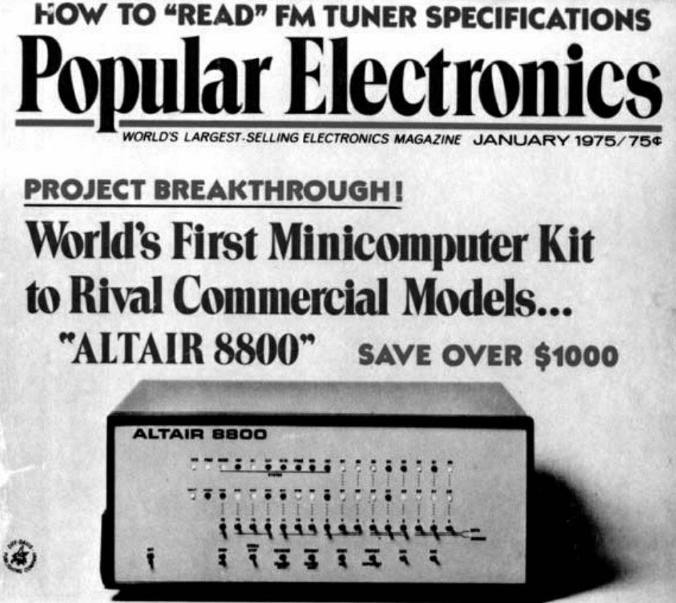

# 第 5 章 另一条路

1995 年的夏天，我和我的朋友罗伯特·莫里决定创业。那时，正赶上网景公司的股票即将上市，各种公关活动如火如荼，媒体都在谈论网络商务。当时大约有 30 家左右的网上商店，全部是手工制作网页。如果网络商务真要大规模发展，必须用专门的软件制作网上商店，所以我们决定动手写这样的软件。

第一周，我们打算写一个传统的桌面软件。没过几天，我们就想了另外一个方法：可以让软件在服务器上运行，浏览器作为操作界面。我们试着重写，让所有操作都通过网络完成。那时已经很清楚了，这就是我们的方向。如果软件运行在服务器上，一切都会简单得多，无论对于用户，还是对于我们。

事实证明我们是正确的。我们的公司后来被雅虎收购，现在的名字是 Yahoo Store。我们的软件是最受欢迎的网上商店生成器，用户超过 2 万人。

创立 Viaweb 的时候，我们对别人说软件运行在服务器上，几乎没人懂这是什么意思。直到一年后，Hotmail 开始运作，人们才有点儿明白这个概念。现在，大家都知道了这是一个可行的方法，而且我们还有了专门的名字：应用服务供应商（Application Service Provider），简称 ASP。我认为，大量的下一代软件都将采用这个模式。甚至最大的输家——微软公司，看来也明白了，部分软件从桌面消失将是不可避免的。如果软件从桌面移到服务器上，对于开发者来说，一切将发生根本性的变化。本文将站在先行者的角度，描述我们正在经历的种种令人惊叹的变化。由于软件转移到服务器的趋势才刚刚开始，所以我下面所写的是对未来的憧憬。

## 下一个潮流？

回顾桌面软件时代，我想我们会为人们忍受的种种不便惊叹不已。这就好像汽车刚诞生的时候，车主忍受的不便会令现在的人们惊叹不已一样。汽车诞生的头二三十年，你想当车主，非得成为汽车专家不可。但是汽车用处太大了，很多不是专家的人也想拥有它们。

计算机现在就处在这个阶段。一旦拥有了桌面电脑，你就被迫不情愿地学习很多东西，了解它的内部运作机制。超过一半的美国家庭拥有电脑，我妈妈就有一台，用来收发邮件和记账。几年前，她收到苹果公司的一封来信，上面说她可以优惠购买新版的操作系统。老太太被这些术语吓坏了。一个 65 岁的妇女，只用电脑收发邮件和记账，却被迫要和操作系统打交道，搞清楚要不要安装一个新版本，这真是太过分了。普通用户根本没必要知道“操作系统”这个词，更不要说“驱动程序”和“补丁”了。

现在，可以有另一种方法发布软件，用户再也不会被迫当上系统管理员了。互联网软件运行在服务器上，用户界面就是网页。对于普通用户来说，使用这种新型软件将更容易、更便宜、更机动、更可靠，通常也比桌面软件更强大。

使用互联网软件，除了软件本身，大多数用户不需要知道别的事情。所有那些乱七八糟、经常变动的东西，都放在服务器端，由精通此道的专业人员维护。所以，大多数时候，你不需要一台全功能的电脑（即本身可以运行软件的电脑）。你所需要的设备只要有键盘、屏幕、浏览器就够了，可能还有无线网卡。这样的设备没准就是指手机。不管它是什么，它肯定是一种消费类电子产品，价格大概在 200 美元左右，所以人们主要根据外观选择购买。你支付的上网费会超过硬件费用，就好像现在你的电话费超过电话机的价格一样。

数据在客户端与服务器之间走一个来回大概耗时 0.1 秒，所以与用户密集互动的软件（比如 Photoshop）仍然会把数据处理的部分放在桌面端。但是看看大多数人使用计算机的目的，你会发现 0.1 秒的时滞根本不成问题。我妈妈其实真的不需要一台桌面电脑，完全可以用互联网软件替代。像她这样的电脑用户有很多。

## 用户的胜利

我家附近，一辆汽车的保险杠贴着一张粘纸，上面写着“太麻烦，不如死”（death before inconvenience）。大多数人，在大多数时候，总是选择最省事的做法。如果互联网软件能够击败桌面软件，一定是赢在更方便这一优势上。无论从用户的角度还是从开发者的角度来看都是如此。

使用那些纯粹的互联网软件，你只需要一个能够上网的浏览器即可。所以，它不受地域限制，在任何地方都可以使用。但是，如果你使用安装在计算机上的桌面软件，那么就只能在这台计算机上使用。更糟的是，你的文件也存在这台计算机上。随着互联网越来越深入人心，桌面模式的弊端也就越来越明显。

最典型的例子就是网络界面的 Email。大家现在都认定，随时随地都应该可以收发 Email。如果 Email 是这样，为什么日程表不能这样呢？如果你能看到同事的文档，为什么不能编辑它呢？为什么你的数据非得禁锢在一台遥远写字桌上的电脑里呢？

“你的电脑”这个概念正慢慢成为过去时，取而代之的是“你的数据”。你应该可以从任何电脑上获取你的数据。或者更准确地说，在任何终端设备上获取你的数据，终端设备不一定是电脑。

终端设备不应该存储数据，它们应该像电话那样。事实上，终端设备最后可能就会变成电话，或者反过来，电话变成终端设备。终端越做越小后，你可以每天把它带在身上，就更没理由把数据存储在上面了，万一遗失或者被窃就很麻烦。把 PDA 遗忘在出租车上无异于损失一块硬盘，唯一的区别是你的数据现在掌握在别人手里，而不是被擦掉了。

有了互联网软件，你的数据和软件本身都不保存在终端设备上，不用安装就能使用。既然不用安装，也就不用担心安装出错了，再也不会有应用软件与操作系统不兼容的问题了，因为软件与你使用的操作系统彻底无关。

由于没有安装这一步，所以在“购买”之前试用互联网软件将变得非常普遍、非常容易。只要联上网站，应该就能免费试用该网站提供的服务。Viaweb 的整个网站处处都是鼓励用户试用的提示。

试用 demo 之后，就可以登记成为正式用户了，只需要填一个很简单的表单。这应该是用户需要做的最后一点“多余的事情”了。使用互联网软件，你不需要为新版本付出额外的费用，或者做额外的准备工作，甚至可能你都不知道软件已经升级了。

现在，升级不再对用户形成大的冲击。久而久之，软件变得更强大了。这需要开发者付出一定的努力。他们必须正确地设计软件，使得它能够平滑升级，不让使用者感到困惑。这就是互联网软件面临的新问题，不过解决办法是有的。

所有用户都使用同样版本的互联网软件，bug 一发现就会立刻得到纠正。所以，它的 bug 应该比桌面软件少得多。在 Viaweb，我记得未解决的 bug 最多一次也总共只有十个，大部分问题都是一发现就得到了解决，不会遗留下来。这要比桌面软件小一个或几个数量级。

互联网应用程序能够同时被多人使用，所以非常适合团队协作性的工作。大多数用户现在还不了解软件协同办公，否则估计他们会强烈要求大部分应用程序都具备这个功能。举例来说，允许两个用户同时编辑一个文档是一项很有用的功能。Viaweb 允许多个用户同时制作一个站点，主要原因倒不是因为用户要求，而是考虑到这是开发软件的正确方式，但是最后发现大多数用户都希望这样。

如果使用互联网软件，数据会更安全。即使硬盘损坏的风险依然存在，但是与用户没有关系，他们可以从此不关心这件事。风险发生在机房。互联网软件的运营方会备份数据，不仅因为它们的系统管理员很关心这一类事情，还因为一且数据丢失，公司将面临极大的麻烦。如果用户自己的硬盘坏了，他们不会发狂，因为不能去责怪别人；如果一家公司丢失了他们的数据，他们会怀着超乎寻常的怒火，冲着这家公司发飙。最后，互联网软件不太容易感染病毒。如果客户端只运行一个浏览器，病毒运行的概率就比较小，本机的数据不会遭到破坏。而专门攻击服务器端的病毒比较容易防御。

对于用户来说，使用互联网软件不会有太大的压力。我觉得，大多数 Windows 用户使用桌面软件的时候都感到紧张，会有相当大的心理压力。释放这种压力，对你的产品将是一种巨大的推动。

## 代码之城

对于开发者来说，互联网软件与桌面软件最显著的区别就是，前者不是一个单独的代码块。它是许多不同种类程序的集合，而不是一个单独的巨大的二进制文件。设计桌面软件就像设计一幢大楼，而设计互联网软件就像设计一座城市：你不仅需要设计建筑物，还要设计道路、路标、公用设施、警察局、消防队，并且制定城市发展规划和紧急事件的应对方案。

Viaweb 的软件包括：与用户直接对话的一些大型应用程序、被这些大型程序使用的程序、常驻后台报告系统出错的程序、重新启动出错部分的程序、生成统计报告或数据库索引的程序（偶然运行）、回收资源或者移动及恢复数据的程序（手动运行）、伪装成用户的程序（为了测试系统和发现 bug）、诊断网络故障的程序、完成备份的程序、对外提供服务界面的程序、实时显示服务器状态和访问数据的程序（很受用户欢迎，对我们也是必不可少的）、修改后的开源软件程序（包括修正 bug）以及许许多多的配置和设定文件。在我们被雅虎买下以后，Trevor Blackwell 写过一个令人叹为观止的程序，可以在不关闭网站的情况下，将网上商店转移到另一个机房的服务器上。此外，还有向系统管理员发出传呼信号的程序，向用户发传真和电子邮件的程序，引导完成信用卡交易的程序，在套接字、通信管路、HTTP 请求、SSH、UDP 数据包、共享内存、文件之间互相通信的程序。一部分 Viaweb 服务器上故意不安装某些程序，因为保证 Unix 系统安全的关键之一就是不运行那些不需要的东西，降低服务器被侵入的可能性。

光有软件还不够，我们还花了许多时间琢磨服务器应该如何配置。我们自己搭服务器，不仅为了省钱，也是为了让机器完全满足我们的需要。我们还考虑哪些 ISP 连接主干网的带宽比较大。我们一直与 RAID 供应商保持联系。

但是，硬件需要考虑的地方，不仅仅在于怎么才能避免出问题，还在于怎样才能最大地发挥它们的作用。只要你控制了硬件，就能为用户提供更多的功能。如果你的产品是桌面软件，你就只能规定硬件的最低配置，无法为了某一个功能而要求用户增加硬件。但是，如果你控制了服务器，你就能轻而易举地增加功能，使用户可以发出寻呼、发送传真、通过电话操作网站、使用信用卡付款等。你所需要做的只是安装相关的硬件。我们总是在寻找通过硬件增加新功能的方法，因为这可以赢得用户，还可以让我们超越那些不直接控制硬件的竞争者（他们要么出售桌面软件，要么通过 ISP 分销互联网软件）。

由于互联网应用程序由多种软件而不是单独一个二进制文件构成，所以可以使用多种编程语言开发。如果你的产品是桌面软件，一般来说，你总是被迫采用与操作系统一致的语言，也就是 C 和 C++。所以，这些语言就被认为是“正统的”软件开发语言（非技术人员尤其可能这样想，比如经理层和风险投资家）。但是，这其实是一个伪信号（artifact），不能因为桌面软件是这样开发的，就认定所有软件都是这样开发的。对于互联网软件，你可以使用任何你想用的语言。当今，许多顶尖黑客使用的语言与 C 和 C++大相径庭：Perl，Python，甚至还有 Lisp。

对于互联网软件，没人规定只能使用某些语言开发，因为所有的硬件都控制在你手里，你想要用什么语言，就能用什么语言。不同的语言适合不同的任务，你应该根据不同场合，挑选最合适的工具。尤其是在竞争者存在的情况下，“可以这样做”就变成了“必须这样做”（详见后文），因为如果你不利用语言的优势，那就会听任对手超过你。

我们的大多数竞争者使用 C 和 C++，这使得他们的软件明显不如我们，因为（不考虑其他原因）他们无法解决 CGI 脚本不能识别用户状态的问题。如果用户想要修改表单的部分内容，你不得不把表单的所有内容都放在同一个页面上，然后在最下面放一个“更新”按钮。正如我将在第 12 章中解释的，通过使用 Lisp 这种许多人眼中的教学语言，我们使得 Viaweb 编辑器更接近桌面软件带给用户的体验。

## 软件的发布

互联网软件带来的最大变化之一，就是软件发布方式的改变。对于桌面软件来说，发布新版本是一个很痛苦的过程，整个公司不得不使尽全力，满头大汗地挤出一大块巨型代码。从过程和结果上来看，无异于一次分娩。

互联网软件则完全不同，就像你写给自己用的程序一样，修改起来很方便。软件的发布过裎可以分解为一系列的渐进式修改，而不是猛地推出一个大幅变动的版本。常见的桌面软件可能一年发布一到两个新版本，而我们在 Viaweb 经常是一天发布三到五个版本。

一旦采用了这种新模式，你就会知道发布方式对软件开发的影响有多么重大。桌面软件开发之中的许多棘手问题，都是源自于它的那种灾难性的发布方式。

如果一年发布一个新版本，你很可能会以打包方式处理 bug，把它们留着，然后一次性全部解决。在发布新版本前，你可能会修改和更换一半的代码，从而又引入无数新的 bug。接着，质量监控人员（Quality Assurance）开始测试新代码，逐一列出新发现的 bug，你再按照这张清单把它们一个个消除。通常没办法把清单全部做完，它随时都在增长，说实话，谁也不确定它到底会有多长。这就好像在足球场上捡小石块一样费劲，你永远不知道为什么软件内部会出这么多问题。最好的结果也不过是，你得到了一个统计学意义上“合格”的版本。

对于互联网软件来说，大部分的变化都是细微和渐进的，所以引入 bug 的机会比较小。而且，在发布前测试的时候，你知道应该最仔细地测试哪个部分——显然就是你修改过的部分。这使得你对代码的掌握变得牢固得多。一般来说，这时候你确实是对软件内部的情况一清二楚。当然，这不是说你把所有代码都装在了脑子里，而是说你阅读代码的时候，非常自如流畅，不会像侦探破案那样苦思冥想，而是像飞行员那样，瞄一眼仪表板，就对飞行状况胸有成竹。

桌面软件导致了 bug 的宿命论。你很清楚，发布出去的软件肯定有 bug，你甚至早就准备好了应对机制（比如发布补丁）。既然如此，bug 再多一点又何妨？没过多久，你要发布下一个版本了，你明知其中某个操作完全不能使用，但还是照样发布。苹果公司前几年就干过这种事。他们必须发布新版操作系统了，压力越来越大，发布日期已经推迟了四次，无法再推了，可是有些部分还一点儿没写（比如 CD 和 DVD 操作的部分）。怎么办？他们就把没写完的操作系统发布出去了，用户必须日后自己动手安装缺失的部分。

互联网软件的发布规则是：它运行不了，你就无法发布；一且它能运行了，你就可以立刻发布。

这个行业的老手可能会想：你说得好听！软件运行不了，就不发布，但是如果你已经对外承诺了明确的发布日期，到时却没有准备好，怎么办？这个问题听起来有道理，但是事实上，你不会对互联网软件做出这样的承诺，因为它根本没有“版本”这个概念。你的软件是连续性渐变的，某些更新也许比较重大，但是“版本”这个概念不适用于互联网软件。

如果你还没忘记 Viaweb 的旧事，你可能会觉得我这么说听上去很奇怪，因为那时我们总是宣布将有新版本推出。这只是公关伎俩啦，我们知道媒体喜欢听到版本号。如果你发布一个大的版本更新（版本号的第一位数发生变动），它们就会以大篇幅报道；如果你发布一个小的版本更新（版本号小数点后发生变化），它们最多只用一段话提一下。

我们的一些竞争对手的产品是桌面软件，确实有版本号。对我们来说，这种发布方式只表明他们的落后，但是他们却因此把媒体的目光都吸引过去了。我们不想做局外人，所以也开始为自己的软件加上版本号。什么时候需要媒体宣传了，就开出一张单子，上面总结了自从上次“发布”以来，我们新增的所有功能，然后在上面填一个新的版本号，发出一个新闻稿，宣布新版本已经准备就绪了。真是神奇啊，从来没有人看穿我们的把戏。

到被收购的时候，我们已经这样干了三次，所以已经到了第四版。如果我没记错的话，那时是 4.1 版。Viaweb 变成 Yahoo Store 以后，媒体的曝光就没有那么必要了。所以，虽然软件一直没有中断开发，但是版本号却悄悄地被放弃了。

## 软件 bug

互联网软件的另一个技术优势在于，你能再现大部分的 bug。用户的数据都在你的硬盘上。如果某个用户使用软件时出错了，你就不必像开发桌面软件那样苦苦猜测到底发生了什么事情。一般来说，只要用户通过电话向你描述一番，你就能把问题再现出来。如果你的程序中有自动侦测错误的代码，那么不用等到用户找上门，你可能已经知道哪里出错了。

互联网软件每时每刻都在被使用。你的代码一上线，就会经历严酷考验。bug 很快就会浮出水面。

软件公司有时会受到指责，因为他们竟然把发现 bug 的任务交给用户去完成。说实话，我其实提倡这种做法。对于互联网软件，这样做的好处很多，因为它的 bug 相对比较少，而且处理周期比较短。我们连续不断地发布新版本，所以 bug 就比较少。我们能够再现用户遇到的问题，又能在修复后立刻发布，使得用户不用等很长时间，所以大部分 bug 的处理周期都比较短。我们的 bug 数量一直不多，以至于没有必要使用一个正式的 bug 追踪系统。

当然，在发布之前，你应该对修改之处进行测试，避免出现重大的 bug。难免会有一些 bug 成为漏网之鱼，不过它们纯属罕见情况下才会发生的个案，在真正接到用户投诉之前，几乎不会影响到什么人。只要你能立刻解决 bug，对于普通用户来说，他们就会觉得你的软件几乎是亳无问题的。我觉得，普通的 Viaweb 用户可能一个 bug 都没遇到过。

解决新代码的 bug 要比解决历史遗留代码的 bug 容易。在自己刚刚写好的代码中，找出 bug 往往会比较快。有时，你只要看到出错提示，就知道问题出在哪里，甚至都不用看源码，因为潜意识中你已经在担心那个地方可能会出错。如果你要解决的 bug 出自于 6 个月前写好的代码（假定你一年发布一个新版本，那么 6 个月就是发现 bug 的平均时间），那么就麻烦了，就要大费周章了。那时，你对代码也已经不熟悉了，就更可能采用危险的方式解决问题，甚至引入更多的 bug。

早一点发现 bug 就不容易形成复合式 bug，也就是互相影响的两个 bug。举例来说，一个 bug 是楼梯很滑，另一个 bug 是扶手松了，那么只有当这两个 bug 互相作用时，才会导致你从楼梯上摔下来。在软件中，复合式 bug 是最难发现的 bug，往往也会导致最大的损失。传统的方法是：“把软件彻底拆开，将所有 bug 统统清理干净。”这样做难免产生一大堆的复合式 bug。如果软件是经常性发布，每次只有小幅度的变化，那么就不容易产生复合式 bug。这就好比做扫除：你一直在打扫大厅，掉落在地板上的东西会被立刻清理，省得它们时间一长与其他东西粘在一起。

有一种编程方法叫做“函数式编程”（functional programming），它对你会有帮助，可以避免一些副作用。函数式编程在学术文献中研究得比较多，在商业软件中用得比较少。但是，对于互联网软件，它却很有用。很难用纯粹的“函数式编程”完成整个程序，但是它可以用来编写一些重要的部分，使得这些部分易于调试，因为它们不包含“状态”（state），非常便于不断进行小幅的修改和测试。我大量使用这种方法开发 Viaweb 的编辑器，我们自己的脚本语言 RTML 就是一种纯粹的函数式编程语目。

桌面软件行业的人可能很难相信，找出 Viaweb 的 bug 几乎成了一种游戏。因为软件发布以后，大多数 bug 都是罕见情况下才会发生的个案，受到影响的用户往往都是高级使用者，他们喜欢试验那些不常用的、难度大的操作。高级使用者对 bug 的容忍度比较高，尤其如果这些 bug 是在开发新功能的过程中引入的，而这些新功能又正是他们所需要的，他们就更能理解了。事实上，因为 bug 不多，你只有经过一些复杂的过程以后才会遇到它们，所以高级使用者往往因为发现了 bug 感到很得意。他们打电话给客服时，多半是一副胜利者的口吻，而不是怒气冲冲的样子，好像他们击败我们得分了一样。

## 客户支持

当你可以再现错误时，你开展客服支持的方式就变了。大多数软件公司将客户支持看作提高客户满意度的一种方式。在这些公司看来，要么是客户打电话来，报告一个已知的 bug，要么是客户执行了错误的操作，你必须判断出他到底什么地方做错了。这两种情况对公司的知识积累都没有太大益处。所以，你开始觉得客户支持是一件令人头痛的事情，决定将客服人员与开发人员尽可能分离。

Viaweb 不是这样。我们的客户支持是免费的，因为我们希望知道用户的反应。如果他们使用时遇到困难，我们希望立刻知道，这样就能再现错误、解决问题、发布新版本。

所以，Viaweb 的开发人员总是与客服人员保持密切联系。客服人员坐在距离程序员只有 9 米的地方，知道自己可以随时打断程序员的工作，提交新证实的 bug 的报告。遇到重大 bug，我们就算在开董事会，也会马上回来修改程序。

我们的这种方法让所有人都感到满意。客户很高兴，拨打厂商服务热线是免费的，而且还被当作通风报信的人，受到郑重对待。客服人员也喜欢这样，因为这使得他们可以帮助用户，而不是对着用户读操作手册；程序员喜欢这样，因为他们能够再现 bug，而不是通过模糊不清的二手报吿了解 bug。

我们的政策是当场修复 bug，这改变了客服人员与黑客之间的关系。在大多数软件公司，客服人员是低工资的边缘人，黑客则是呼风唤雨的主宰者。这些公司有各种各样的 bug 报告流程，伹是几乎都是单向式的：使用者打电话给客服人员报告 bug，客服人员填写某种形式的表格，传递给程序员（可能会经质量监控部门之手），程序员把 bug 写入待解决问题的清单。Viaweb 不是这样，在收到使用者的 bug 报告之后一分钟内，程序员就会对站在身边的客服人员说：“没错，你是对的，这是一个 bug。”客服人员从黑客嘴里听到“你是对的”，会感到欢欣鼓舞。客服人员告诉我们发现 bug 的时候，他们心里怀着期待，就好像小猫想让别人知道自己抓住了一只老鼠一样。这也使得客服人员在判断 bug 严重性时格外小心，因为这关系到他们的声誉。

我们被雅虎收购后，客服人员被移到离程序员很远的地方。直到那时，我们才意识到客户支持实际上就是质量监控，也是某种程度的市场营销。除了记录 bug，客服人员还必须大概了解相关知识，回答与 bug 相关的一些问题、解释令使用者迷惑不解的功能等。有时，他们也扮演了使用者的代理人，我们会问他们哪个新功能是用户更想要的，他们总是能做出正确的回答。

## 全身心投入

能够即时发布软件，对开发者是一个巨大的激励。步行上班途中，我经常会想哪些地方还需要变动，然后当天就予以实现。一些重大功能也是这样来的。即使某个功能要花两个星期（或者更长时间）开发，我也很确定，一旦写完就可以立刻看到效果。

如果软件的新版本要等到一年后才能发布，我就会把大部分新构思束之高阁，至少过上一段时间再来考虑。但是，构思这种东西有一个特点，那就是它会导致更多的构思。你有没有注意过，坐下来写东西的时候，一半的构思是写作时产生的？软件也是这样。实现某个构思，会带来更多的构思。所以，将一个构思束之高阁，不仅意味着延迟它的实现，还意味着延迟所有在实现过程中激发的构思。事实上，将一个构思束之高阁，甚至会限制新构思的产生。因为你看一眼堆放在一边、还没有实现的构思，就会想“我已经为下一个版本准备了很多新东西要实现了”，你就懒得再思考更多的新功能了。

大公司的做法不是立刻实现新功能，而是先对新功能做一个计划。我们在 Viaweb 就是因为这个原因而遇到了麻烦。投资者和分析家会问，你们对未来有何计划。真实的回答是，我们没有任何计划。我们有改进的想法，但是如果我们想到应该怎么改进，就已经把它实现了。接下来六个月我们要做什么？所有能想到的最佳改进。我不知道自己是否有胆量公开这么说，但这是实话。计划这个词，只是将构思束之高阁的另一种表达方式。只要想到好的构思，我们就立刻着手实现。

Viaweb 和其他许多软件公司一样，大部分代码都有明确的负责人，而且只有一个。如果你负责某件事，那就真的是你负责。除了你以外，没有人能批准（他们甚至都不知道）这部分代码的发布。如果你出错了，没有人会提醒你，唯一的代码保护机制就是你的羞耻心，你不想被同事当成傻瓜，这就足矣。我这么说或许会让人误以为 Viaweb 的代码是漫不经心地编写出来的。实际上我们的开发进度很快，但是把代码放到服务器上发布之前，我们会深思熟虑。提高软件可靠性的关键在于开发时全神贯注，而不是降低开发速度。正是因为飞行员全神贯注，他才能在夜间让一架 18 吨重的飞机以 225 公里的时速平安降落在航空母舰的甲板上，做得比小孩子切面包还要安全。

当然，这样写软件也有局限。它适用于小型的、由优秀可靠程序员组成的开发团队，不适用于大型的、充斥大量平庸之辈的软件公司，在那里不是程序员想出好的构思，而是一个委员会集体批准坏的构思。

## 逆向的《人月神话》

幸好开发互联网软件需要的程序员比较少。我曾在一家中等规模的桌面软件公司工作，那里的工程部规模就超过 100 人，但是其中只有 13 人负责产品开发，剩下的人负责软件发布、软件移植以及其他事情。开发互联网软件，你最多只需要那 13 个人，因为不存在软件发布、软件移植以及其他事情。

Viaweb 的开发者只有 3 个人。我一直在不停地招聘，压力很大，因为我们要把公司卖掉。我们很清楚地知道，买家不愿花大价钱买下一个只有 3 个程序员的公司。（解决方法：雇更多的人，在公司内创设其他项目，让他们去做。）

开发软件需要的程序员人数减少，不仅意味着省下更多的钱。正如《人月神话》一书中所指出的，向一个项目增加人手，往往会拖慢项目进程。随着参与人数的增加，人与人之间需要的沟通呈现指数式增长。人数越来越多，开会讨论各个部分如何协同工作所需的时间越来越长，无法预见的互相影响越多越大，产生的 bug 也越多越多。幸运的是，这个过程的逆向也成立：人数越来越少，软件开发的效率将指数式增长。我不记得我们在 Viaweb 开过讨论如何编程的会议。步行去吃午饭的路上，我们就能把该说的话说完，从来没有例外。

如果要说有什么缺点，就是由于开发人员比较少，每个程序员都必须承担一点儿系统管理的责任。当你在服务器上发布软件时，必须有人监控服务器，但是由于人员太少，监控员只能由开发人员兼任。Viaweb 有许多系统组件，变动非常频繁，导致应用软件和系统软件之间的界线很难区分。硬性指定一条界线将限制我们的开发。所以，虽然我们总是安慰自己，公司运营很快就能走上正轨，一两个月后就能平稳发展，那时就可以雇一个专职的系统管理员让他专门负责服务器了，但是这个愿望一直没有实现。

只要你还在很活跃地开发产品，就免不了要亲自做系统管理，我认为没有其他可能。如果你梦想写完代码，向服务器递交（check in），然后就可以回家，一天工作结束，这在互联网软件身上肯定没有实现的可能。互联网软件是活的，每时每刻都在你的服务器上运行。一个严重的 bug 影响的可能不是一个用户，而是所有用户。如果某个 bug 破坏了硬盘上的数据，更是必须马上修复，诸如此类。我们的心得是，第一年之后就不必每分钟都盯着服务器了，但是对新变动的部分一定要密切关注。不要在半夜里发布代码，然后回家睡觉。

## 关注用户

互联网软件不仅把开发者与他的代码更紧密地联系在了一起，而且把开发者与他的用户也更紧密联系在了一起。财务软件公司 Intuit 的销售方式很出名，他们的销售员会在软件零售店里向顾客做自我介绍，然后请求顾客跟他们回公司，以便进一步了解软件。如果你亲眼见到某人第一次使用你的软件，你就会知道软件的哪个地方最打动他。

软件应该做到用户认为它可以做到的事情。但是，你不知道用户到底怎么想，除非你亲眼看到他们如何使用你的软件，相信我，看到和看不到大不相同。互联网软件能够让你前所未有地了解用户行为。你不必再人为挑选一个小型的用户样本，进行重点观察。每个用户的每一次点击你都可以看到。所以，你不得不仔细斟酌到底要看哪些行为，因为你不应该侵犯用户的隐私。但是，即使是最常见的统计项目，也能提供大量信息。

因为你能得到用户数据，所以就不用依赖基准测试了。基准测试不过是在模拟用户，而你现在能看到真实的用户。你想知道应该优化什么地方，那就登录到服务器，看看什么程序最消耗 CPU。你也会知道什么时候应该停止优化，当我们后来发现 Viaweb 编辑器的瓶颈是内存而不是 CPU 时，就知道可能应该停止优化了，因为我们没办法压缩用户数据的大小。（唉，其实是有办法的，但是做起来很不容易。）

效率对互联网软件至关重要，因为硬件费用由你支付。你的资本支出成本除以服务器所能支持的最大用户数量，就是你为每个用户付出的成本。如果你的软件效率高，你就能比同样硬件配置的竞争对手多发展用户，获得更多的利润。我们在 Viaweb 的时候，每个用户的硬件成本大约是 5 美元，现在应该更低，可能比把第一个月的账单寄给他们的成本还要低。如果软件效率足够高，每个用户的硬件成本现在可以接近免费。

关注用户不仅有助于优化程序，还有助于指导你的设计。Viaweb 的脚本语言 RTML 允许高级用户自定义页面风格。我们发现 RTML 有点像留言本，用户通过它向我们提建议，因为只有当预设的页面风格不能满足用户需求时，他们才会使用 RTML。举例来说，编辑器的工具栏原先是横跨页面的，但是许多使用 RTML 的用户将它放在左下方，于是我们也就把工具栏的默认位置调整为左下方了。

最后，通过关注用户，你可以知道他们在使用软件的过程中什么时候遇到了麻烦。因为顾客总是对的，所以这表明你需要修正软件。推广 Viaweb 的关键，就是允许访问者在线试用。这可不是仅仅展示几张图片，而是真的让你使用我们的产品。只需要五分钟，你就能自己搭建起一个真实可用的网上商店。

几乎所有我们的新客户都是通过在线试用发展起来的。我想大多数互联网软件都是如此。如果用户坚持从头到尾成功地完成在线试用，那么表明他们喜欢这个产品。如果他们感到很困惑或者很乏味，就不会坚持试用到底。所以，只要我们能让更多的访问者坚持完成在线试用，我们的用户增长率就会提升。

我研究了用户点击行为，发现在某一个地方，在线试用的用户会停止前进，改为点击浏览器的“后退”按钮。（如果你写过互联网软件，你会发现“后退”按钮是设计中最费脑筋的问题之一，很有意思。）所以，我就在那个地方加了一条提示，告诉用户已经接近终点了，提醒他们不要点击“后退”按钮。这时，互联网软件的另一个好处就体现出来了，你做了修改，马上就可以得到反馈。完成在线试用的用户比例从 60%立刻上升到了 90%。由于新增付费用户的数量是完成在线试用的用户数量的一个函数，所以与修改前相比，我们的收入增长了将近 50%。

## 金钱问题

20 世纪 90 年代早期，我读过一篇文章，它称应该让用户像订报纸那样按照使用时间长短订购软件的使用权。第一眼看上去，这种说话好像很滑稽。但是后来，我意识到这个观点是对的，因为它反映了软件开发的现实：软件开发不是静态的，而是一个持续不断的动态过程。按照传统的软件销售模式，厂商每推出一个新版本，就会强迫现有用户重新出钱购买，然后安装升级，只有这样厂商才能持续不断获得收入。我认为，如果公开收取软件的订阅费，而不是让用户购买软件的所有权，操作起来会更自然、更简便。“订报纸模式”正是互联网软件天然的收费模式。

互联网软件不可能用自由软件的模式经营，只能由商业性公司来经营。因为经营互联网软件要承担很大的风险，会产生大量支出，没有人会免费做这件事情的。

对于软件公司来说，互联网软件是一个很理想的收入来源。你每个季度的销售额不是从零开始，而是拥有一个持续的现金流。因为互联网软件每时每刻都可以升级，所以你不用担心做错什么事。事实上，你不可能真的做错什么事，因为如果用户痛恨你对软件的修改，你马上就会知道。你也不会有坏账的烦恼，如果谁不付钱，你就停止对他的服务。此外，你也不可能遇到盗版问题。

没有盗版是一种“优势”，但也是一个问题。一定数量的盗版对软件公司是有好处的。不管你的软件定价多少，有些用户永远都不会购买。如果这样的用户使用盗版，你并没有任何损失。事实上，你反而赚到了，因为你的软件现在多了一个用户，市场影响力就更大了一些，而这个用户可能毕业以后就会出钱购买你的软件。

只要有可能，商业性公司就会采用一种叫做“价格歧视”（price discrimination）的定价方法，也就是针对不同的客户给出不同的报价，使得利润最大化。软件的定价特别适合采用价格歧视，因为软件的边际成本接近于零。这就是为什么很多软件的 Sun 服务器版本比 Intel 服务器版本更贵的原因，因为如果一个公司购买 Sun 服务器，就表明它很有钱，不在乎对设备的投资，那么为什么不向它开个高价呢？盗版实质上是一种价格歧视，只不过针对的是最底层的消费者。我觉得，软件公司明白这个道理，所以故意对某些盗版行为睁一只眼闭一只眼。由于互联网软件无法盗版，所以软件公司必须想出其他策略推广软件。

相比桌面软件，互联网软件卖得更好，因为它易于销售。你可能认为，购买商品时，人们是先做出决定，然后再购买，好像这个行为分成两个独立的步骤。创立 Viaweb 之前，我也是这样想的，不过我从未对这个问题进行过深入思考。事实上，第二步对第一步有反作用，如果某样商品购买起来很困难，人们就会改变主意，放弃购买。反过来也成立，如果某样东西易于购买，你就会多买一点。自从有了亚马逊网上书店，我买的新书比什么时候都多。互联网软件提供的服务可能是世界上购买起来最方便的东西，如果你试用完 demo 再买，那就更是如此了。购买时，除了输入信用卡号码以外，用户不应该再被要求做其他事。（要求用户做得越多，你担的风险就越大。）

软件公司有时会采用分销模式，让 ISP 分销互联网软件。这样做很不好。服务器必须在你自己的控制之中，因为你需要不断改进硬件和软件。如果你放弃对服务器的直接控制，你就放弃了互联网软件的大部分优势。我们的几个竞争对手就采用分销模式，那是作茧自缚。我常常想，这可能因为他们受到某些西装革履、衣冠楚楚的家伙的压制。后者只看到分销管道的销售潜力是多么令人兴奋，却没有意识到这将毁了他们正在销售的产品。通过 ISP 分销互联网软件，就好比让自动售货机出售寿司。

## 目标客户

谁是互联网软件的目标客户？Viaweb 一开始就把个人和小企业当作目标客户。我认为这是互联网软件的通行规则。这些客户决策比较灵活，又需要低成本的新技术，所以他们更愿意尝试新事物。

互联网软件往往也是大公司的最佳选择。（虽然大公司反应迟钝，不一定能意识到这一点。）最好的内部网（intranet）就是互联网（Internet）。如果一家公司采用互联网软件，那么这家公司的软件系统将表现得更出色，服务器将得到更好的管理，员工可以不受地域限制使用这个系统。

反对者往往声称互联网软件不安全。如果员工可以很容易地登录，那么坏人也可以很容易地登录。一些大型批发商就不太愿意使用 Viaweb，觉得不能把客户的信用卡资料交给我们，而是放在自己的服务器上更安全。可能没法很婉转地向他们表达我们的观点，但是事实上，他们的服务器就是没我们的安全，我们对数据的保护几乎肯定比他们好。想想看，谁能雇到更高水平的网络安全专家，是一个所有业务就是管理服务器的技术型创业公司，还是一家服装零售商？不仅因为我们有技术水平更出色的员工，还因为我们比他们更关心数据的安全。如果一家服装零售商的服务器被入侵，最多只影响到这家公司本身，这件事也很可能在公司内部被掩盖起来，最严重的情况下可能还会有一个员工被解雇。但是，如果我们的服务器被入侵，就有成千上万家公司可能受到影响，这件事也许还会被当作新闻发表在业内新闻网站 CNet 上面，使得我们的生意做不下去，不得不关门歇业。

如果你想把钱藏在安全的地方，请问你是选择放在家中床垫下面，还是放在银行？这个比喻对服务器管理的方方面面都适用，不仅是安全性，还包括正常运行时间、带宽、负载管理、备份等，都是我们占优。只有把这些事情都做对，我们才能保证自己生存下去。服务器管理对我们是生死攸关的大事，玩具制造商如何看待对人体不安全的玩具，或者食品制造商如何看待感染了沙门氏菌的食品，我们就如何看待有缺陷的服务器管理。

某种程度上，使用互联网软件的大公司就好像把它的 IT 部门外包出去了。虽然听起来很激进，但是我认为这样做很好。比起自己雇用系统管理员，外包可以让这些公司得到更好的服务。非 IT 公司的内部系统管理员没有行业竞争压力，日久天长就会变得工作效率低下、不负责任。要让员工表现优秀，必须有竞争压力。销售员必须面对消费者，程序员必须面对竞争对手的软件，但是内部系统管理员就像老年单身汉，能够激励他的外部压力几乎没有。我们在 Viaweb 就有足够的外部压力，使得我们努力前进，不会被别人甩在后面。我们直接接到客户的电话，而不只是同事的电话。如果服务器被入侵，我们会急得跳起来。即使过了这么多年，我现在想起当时的情景，肾上腺素还是会迅速上升。

所以，互联网软件通常也是大公司的正确选择。可是，大公司太迟钝，不到最后一刻想不通这一点，就像以前他们迟迟没有发现桌面电脑才是计算机发展的方向一样。这也是大公司往往会购买很贵商品的原因之一，所以你高额投入，向大公司推销你的商品，也就变得值得了。

有钱的客户倾向于更贵的选择，即使便宜的选择更符合他们的需要，他们也不会买。这种现象普遍存在。原因就是，那些索要高价的人将更多的钱投入推销。Viaweb 不采用这种做法。互联网咨询公司从我们手里抢走了几个高端商家。他们说服这些商家，让他们相信更好的选择就是，花 50 万美元，将网上商店开在自己的服务器上。结果是意料之中的，当圣诞节购物高峰来临时，服务器的负载陡然上升，这些商家一个接一个地发现，他们的选择并不是那么正确。Viaweb 的系统远比大多数商家自己搭建的系统更高级更先进，但是我们付不起高额的宣传费，无法让他们明白这一点。我们的宣传费每月只有 300 美元，无法派遣一个衣冠楚楚、言之凿凿的团队到客户公司做演示。

有一段时间，我们构思了一种新类型的服务，名叫“Viaweb 黄金版”。它比我们普通类型的服务贵十倍，但是功能一模一样，唯一的区别就是有专人穿着西装面对面把它卖给你。我们从未把这个构思付诸实践，但是我很肯定，要是真推出的话，一定会有商家购买。

大公司付出的高价之中，很大一部分是商家为了让大公司买下这个商品而付出的费用。（如果国防部花 1000 美元买一个马桶座圏，部分原因是要让国防部买下它本身就需要花很多钱。）这就是为什么公司内部的局域网软件明明不可取、但是还会继续存在并且不断发展的一个原因。这样的软件更昂贵，但是你对这个难题就是无能为力。所以，最好的安排就是把个人和小企业客户放在第一位。其他的客户该来的时候就会来。

## 桌面电脑

在服务器上运行软件并不是新鲜事。事实上，旧有的模式就是这样，大型机的应用程序都是在服务器上运行的。如果这个模式真那么好，为什么以前没有获得成功呢？为什么随着桌面电脑的兴起，大型机变得黯然失色呢？

刚开始的时候，桌面电脑似乎对大型机不构成威胁。最早的桌面电脑用户只是一些黑客或者业余爱好者（那时，别人就是这么称呼黑客的）。他们喜欢微型计算机的原因只是价格便宜。有史以来第一次，个人拥有了自己的电脑。“个人电脑”（PC）这个词现在是日常语言的一部分，但是当它刚出现的时候，听上去简直就是痴心妄想，就像今天我们听到“个人卫星”（personal satellite）时的那种感觉。

为什么桌面电脑大获全胜？主要是因为它们的软件更出色。为什么它们的软件更出色？原因可能是这些软件是小公司写出来的。

我认为，许多人没有意识到最早的创业公司是多么脆弱和踌躇。许多创业公司的出现完全出于偶然。几个朋友在一起，白天都要上班或者上学，利用业余时间做出一个产品原型，如果这个东西看上去有市场，那么可能就会开公司。在这个雏形阶段，任何重大的阻碍都会把公司扼杀在摇篮中。为大型机开发软件要求大量的前期投入。买一台开发用机已经很贵了，而且因为客户是大公司，所以你还需要一支看上去很气派的销售队伍，这样才能把软件卖出去。创立一家公司专门开发大型机软件是一项艰巨的任务，比你自己利用晚上的业余时间在苹果电脑上写一个东西艰巨得多。所以，只有很少几家为大型机开发应用程序的创业公司。

桌面电脑的出现，带动一大批新软件纷纷涌现，因为对于初生的创业公司来说，开发桌面软件更可行。桌面电脑本身相对便宜，客户又主要是个人，通过电脑商店或者邮寄就可以销售。

把桌面电脑推入主流市场的软件是 VisiCalc，它是第一个电子表格程序，是由两个人在自家阁楼里写出来的，它能做到大型机都做不到的事。在那个时候，VisiCalc 太先进了，人们为了能够使用这个软件，纷纷去购买苹果电脑。这标志了一个新时代的开始，桌面电脑开始成为主流，因为许多创业公司为它写软件。

现在看上去，互联网软件也有这个趋势，因为也有许多创业公司在做这件事。电脑的价格越来越便宜，你可以同我们一样，用一台桌面电脑当作服务器，开始自己的创业。廉价芯片正在侵蚀工作站（你现在甚至很少听到这个词）的市场份额，并且占领了大部分的服务器市场。雅虎公司的服务器能够承受互联网上最高的工作负载，伹是这些服务器的芯片与你的桌面电脑是一样的，都是 Intel 公司低价的处理器。一旦你写出自己的软件，只要搭建一个网站就能销售。几乎所有我们的用户都是听了他人的推荐或者看了媒体的报道。

Viaweb 是一家典型的处于起步阶段的创业公司。我们对开公司这件事都心存恐惧。开始的头几个月，我们安慰自己：就把这一切当作一个实验，随时都可以收拾摊子一走了事。幸运的是，除了一些技术问题，我们几乎没有遇到太大的障碍。写完软件，我们就把开发用的桌面电脑当作了服务器，插上电话线，就与外部世界连接在了一起。这个阶段，我们唯一的支出就是食品和房租。

现在，创业公司有更多的理由选择互联网软件创业，因为开发桌面软件越来越乏味了。如果你现在开发桌面软件，就不得不接受微软公司的授权条款，调用它的 API，为它那个 bug 百出的操作系统伤透脑筋。历尽了千辛万苦，你最终写出了一个大受欢迎的软件，这时你可能会发现，你所做的一切其实只是在为微软公司做市场调查。

如果某家公司想要开发一个平台，吸引他人在此之上创业，这家公司必须使得黑客本人愿意使用这个平台。这意味着它必须是便宜的，而且有着良好的设计。苹果公司的 Mac 电脑自从一问世，就在黑客之中很流行，许多黑客为它写软件。你在 Windows 身上就很少看到这种现象，因为黑客不喜欢使用 Windows。现在，善于写软件的那类人更喜欢使用 Linux 或者 FreeBSD 操作系统。

我想，要是为桌面电脑写软件，我们就不会成立创业公司了。因为桌面软件必须能运行在 Windows 上，要给 Windows 写软件就不得不使用它，可是我们对它并没有兴趣。有了互联网就可以绕过 Windows，直接在 Unix 系统上发布软件，用户通过浏览器使用。这种趋势将会迅猛发展，很像 20 年前 PC 刚刚诞生时的情景。

## 微软公司

回想桌面电脑刚刚出现的时候，人人都对巨无霸 IBM 心存敬畏。现在很难想象那种感觉，但是我对此记忆犹新。现在，令人敬畏的巨无霸是微软公司，我想它面对新技术的威胁不会像 IBM 那样疏忽大意，自以为高枕无忧，毕竟微软的成功就是利用了 IBM 的疏忽。

我在前文提到，我的母亲并不真的需要一台桌面电脑。大多数用户都是如此。这对微软是一个问题，它也知道这一点。如果软件都在服务器端运行，就没有人要用 Windows 了。微软该怎么办？它会利用对桌面电脑操作系统的垄断，阻止或者限制这种新一代的软件吗？

我预计微软会推出某种服务器和桌面电脑的混合产品，让它的桌面操作系统专门与由它控制的服务器协同工作。至少它也会把文件放在服务器上，需要的用户可以自己去下载。我觉得微软不会把运算都放到服务器端，让客户只要有浏览器就行了，它不会走得那么远，除非走投无路了。如果只需要一个带浏览器的终端设备就能完成所有工作，你就不需要微软了。要是微软不能控制终端设备，它就只剩下一条路，就是把用户推向它自己的互联网软件。

互联网对于微软来说，就像《一千零一夜》神话中被关在瓶子里的妖怪，我想微软会有一段很艰难的时期，会千方百计防止妖怪从瓶子里钻出来。未来会出现无数不同类型的终端设备，要想全部控制它们实在是太难了。如果微软专攻某些终端设备，那么竞争者可以为其他终端设备提供应用程序，从而获得击败微软的机会。

在互联网软件的世界，微软并不会因为它在桌面软件世界的成功而自动得到一席之地。也许通过努力它能为自己争取到一个席位，但是我不认为它会主宰这个新的世界，取得桌面软件领域那样的地位。

除了微软自己，没有人能让微软遭受严重挫折。随着互联网软件的崛起，微软不仅要面对新的技术问题，还要面对它自己毫无根据、一厢情愿的旧思维。微软需要把它现有的商业模式拆除，建设一个新模式，我看不到它有正视这个问题的任何迹象。它一心一意地坚持桌面软件模式，固然把它带到现在的地位，但是现在开始将成为它继续前进的障碍。IBM 曾经有过同样的处境，它没有正确应对。在很晚的阶段，它才进入微机市场，并且三心二意没有倾注全力，因为大型机是 IBM 的主要利润来源，发展微机就等于扼杀这头金牛，所以它感到很纠结。微软也同样感到纠结，因为它想保住桌面软件。看来金牛也会成为沉重负担。

我并不是说，互联网软件世界不会产生主宰者。最终，可能会有这样一家公司诞生。但是，我想这需要相当相当长的时间，在此之前则是一段欣欣向荣的混战时期，正如微机诞生的早期。这是创业公司的黄金时代，小公司竞相争艳，做出很酷的产品，使得自己快速发展起来。

## 创业公司

典型的创业公司行动快速，看上去不是那么正式，只有很少几个人，资金也有限。这几个人勤奋工作，技术放大了他们的决策。如果他们赌赢了，那就是一场大胜利。

开发互联网软件的创业公司会把与创业有关的每一件事做到极致。只用更少的人、更少的钱，就可以把软件写出来，并且开始运作。你必须打破常规、快速行动，循规蹈矩不可能成功。你完全能够在只有三个人的情况下让产品开始运营，你们唯一的办公场所就是一间公寓，里面放着一台连着 ISP 的服务器。我们就是这样做的。

纵观创业公司的历史，你会发现它们变得越来越小，越来越快，越来越不像正规的企业。I960 年，所谓“开发软件”就是 IBM 公司的那种形式，满满一屋子的人，他们都戴着牛角质眼镜架，系着细细黑黑的领带，勤勉地埋头写代码，每人每天可以完成十行。到了 1980 年，“开发软件”变成了 8 到 10 人的一个小组，他们穿着牛仔裤上班，在 VT100 终端上打字。现在，“开发软件”则是两个人坐在客厅里，一人捧一台笔记本电脑。（牛仔裤如今已经不能算是不正式的服装了。）

创业公司的压力很大，不幸的是，这一点在互联网软件业也发挥到了极致。许多软件公司的开发者都有一段睡在桌子底下（或者类似经历）的日子，尤其是在初创期。令人惊恐的是，对于互联网软件来说，这样的日子没有尽头，什么都不足以阻止这种事情成为常态。对于桌面软件来说，睡桌子底下的经历经常可以告一段落，等到软件发布了，我们就都回家睡上一个星期。互联网软件永远没有收工的那一天，如果你愿意，可以一直干下去，每天忙上 16 个小时。而且，你能够做到这一点，意味着竞争者也能做到这一点，所以长时间工作变成了一种必需，不得不如此。因为你能做到，所以你必须做到。这简直就是逆向的帕金森定律。

除了长期加班，更可怕的事情是沉重的压力。传统上，程序员和系统管理员有不同的工作职责。程序员关注 bug，系统管理员关注系统的基础设施。程序员可能一整天都在伏案编写代码，然后到了某个时间，就下班回家，不再去想代码了。系统管理员则是永远都无法把工作抛到脑后，可能凌晨 4 点就会被叫到机房，不过好在大多数时候他们的工作都不是很复杂。互联网软件的出现使得这两种工作结合在一起，因此把它们各自不同的工作压力也合在一起。程序员变成了系统管理员，但是工作职责的范围却没有明确界定，使得工作压力陡然增加。

我们创立 Viaweb 时，一开始的六个月都在编写代码。与其他创业公司一样，在这个早期阶段我们的工作时间也是很长的。换作桌面软件公司，度过这个艰苦阶段之后，一切就会变得轻松了，但是当我们结束这个阶段、打开服务器迎接访问者时，才发现与后来的日子相比，第一阶段的编程简直像在度假。雅虎收购 Viaweb，我们第一位的收获当然是金钱，第二位的收获就是能够卸下这些沉重的责任，让一家更大的公司去承担。

桌面软件迫使用户变成系统管理员，互联网软件则是迫使程序员变成系统管理员：用户的压力变小了，程序员的压力变大了。这未必是坏事。如果你的创业公司正在与一家大公司竞争，这一点就很有利。互联网软件提供了一种天然的途径，使得你可以用较少的人力完成较多的工作，从而超过竞争对手。创业公司对这一点应该感到心满意足。

## 勉强够用的网页

有一件事可能会打消你通过互联网软件创业的念头，那就是网页作为用户界面，功能实在是太弱了。我承认，这确实是一个问题。我们真的想改造 HTML 语言和 HTTP 协议，对许多地方进行加强。不过必须指出，目前阶段的网页刚好能满足需要。

以第一代微型计算机作为类比。那些机器上的处理器，本来的生产目的是用在诸如交通信号灯这样的电子设备上的，而不是用作计算机 CPU。但是，像 Altair 的设计者爱德华·罗伯茨这样的人，意识到这些处理器刚好能满足需要。你把一块芯片、存储器（第一台 Altair 的内存是 256 字节）、前面板的指示灯和开关组合在一起，就有了一台可以运行的电脑。能够拥有自己的电脑是非常令人兴奋的事情，所以许多人想买一台，即使它的性能实际上非常低下。

网页刚诞生的时候，也不是为了用作应用程序的界面，它只是刚好能满足需要。对于相当一部分使用者来说，打开浏览器就能使用软件本身，这已足够吸引人了，用户操作界面的丑陋和不方便并不是一个严重的问题。也许你使用 HTML 语言无法写出最美观的电子表格，但是你能写出一个可以供多人在不同地点、不同终端设备上同时使用的电子表格，而且不用安装任何软件，只要有浏览器就可以。你还可以写出数据实时更新，或者一且满足某些条件就会自动发出传呼信号的电子表格。更重要的是，你能用它创造出各种各样甚至还没有名字也没有人想到过的新东西。VisiCalc 可不是某个大型机软件的微机版，而是完完全全的一种薪新的软件。

    

图5-1 Popular Electronics杂志，1975年一月号

当然，互联网软件不一定非做成互联网软件，它也可以做成某种形式的桌面软件。但是，我很肯定，这不是好主意。你自然可以轻易地假设所有人都会安装你的桌面软件，这样就不用考虑很多麻烦问题了，没过多久，你马上就对这一点深信不疑了，所有人肯定真的都会安装你的软件。要是他们不安装，你就惨了。

相比之下，互联网软件不需要做任何关于安装的假设，只要能上网的地方，它就能运行。这个优势已经很大了，随着各种上网设备的迅速发展，优势还会继续扩大。你的软件能用，又不必安装，用户就会喜欢你，你的日子也好过得多，因为你不会被各种各样桌面端的问题烦死。我感到，自己对互联网的观察不会输给其他任何人，但是我也无法预料网络终端设备会怎么发展。一个网页制作比较规范统一的时代也许会到来，但是在什么时候呢？

一切最终会变成什么样子？我不知道。如果你把赌注押在互联网软件上，你也不必担心这个问题。只要人们继续上网，互联网软件就输不了。互联网也许不是唯一的提供软件的途径，但是它现在就能发挥作用，并还将持续很长一段日子。互联网软件的开发成本低，即使是最小型的公司，也可以很容易地制作和发布。互联网软件做起来很辛苦，还有许多特别大的压力，但是这样只会使得创业公司成功的机会变大。

## 为什么不尝试一下？

E.B.怀特曾经从一个农民朋友那里听到一则趣闻。许多农场用电篱笆防止奶牛逃跑，但是不少电篱笆其实并没有通电。不过奶牛们已经吃过苦头，显然学会了不去碰电篱笆，这时不通电也能起到效果。“奶牛们，行动吧！”他写道，“趁着统治者打鼾时，夺回你们的自由！”

如果你是一个黑客，并且梦想自己创业，可能会有两件事情令你望而却步，不敢真正开始采取行动。一件是你不懂得管理企业，另一件是你害怕竞争。可是实际上，这两件事都是没有通电的电篱笆。

首先，管理企业其实很简单，只要记住两点就可以了：做出用户喜欢的产品，保证开支小于收入。只要做到这两点，你就会超过大多数创业公司。随着事业的发展，你自己就能琢磨出来其他的诀窍。

刚开始的时候，你可能入不敷出，但是只要亏损不持续太久，你就不会有事。如果初期阶段缺少资金，这至少有助于你养成勤俭节约的习惯。开支越小，就越不会超支。幸运的是，编写一个互联网软件是非常便宜的。我们的总支出就不超过 1 万美元，现在应该更便宜了。其中，我们不得不花了几千美元买了一台服务器，又花了更多钱购买 SSL。（那时唯一出售 SSL 软件的公司就是网景。）现在，你可以租到一台强大得多的服务器，上面已经安装好了 SSL，而费用比我们当时的带宽费还要少。如今，开发一个互联网软件的费用比购买一把高级办公椅还要便宜。

至于如何做出用户喜欢的产品，下面是一些通用规则。从制造简洁的产品开始着手，首先要保证你自己愿意使用。然后，迅速地做出 1.0 版，并且不断以改进，整个过程中密切倾听用户的反馈。用户总是对的，但是不同的用户要求不一样。低端的用户要求简化操作和清晰易懂，高端的用户要求你增加新功能。软件最大的好处就是让一切变得简单。但是，做到这一点的方法是正确设置默认值，而不是限制用户的选择。如果竞争对手的产品很糟糕，你也不要自鸣得意。比较软件的标准应该是看对手的软件将来会有什么功能，而不是现在有什么功能。无论何时，你都要使用自己的软件。Viaweb 的主要功能是建立网上商店，但是我们也使用它建立自己的网站。不要只因为对方的头衔是市场专家、设计师或产品经理，就盲目听从他们的话。如果他们的观点真的很好，那就听从他们，关键是你要自己判断，不要盲从。只有懂得设计的黑客，才能设计软件，不能交给对软件一知半解的设计师。如果你不打算自己动手设计和开发，那就不要创业。

其次，让我们来看看竞争。你所害怕的大概不是与你一样的黑客，而是那些像模像样，有着办公室、商业计划、销售员的公司，对不对？可是实际上，他们害怕你胜过你害怕他们，而且这一点上，他们并没有错。几个黑客搞懂如何租用办公室，或者如何雇用销售人员，要比那些公司（不管大公司还是小公司）搞懂如何正确写出软件容易得多。我在这两种地方都待过，所以知道这些。Viaweb 被雅虎收购后，我突然发现自己在为一家大公司工作，那感觉就好像在齐腰深的水中艰难行走。我无意贬低雅虎。它拥有一些很好的黑客和顶尖的管理人才。对于一家大公司来说，它可谓是出类拔萃了。但是，它的生产效率仅仅相当于小型创业公司的十分之一。没有任何一家大公司能做得更好。微软公司的恐怖之处在于，它大到可以开发任何软件，就像一座能够行走的大山。

    

图5-2 比尔·盖茨，1977年 

不要被微软吓到。你能做到它做不到的事情，正如它能做到你做不到的事情一样。开发互联网软件不需要得到任何人的许可，没有人能够阻止你。你不需要去申请许可证，不需要在零售店的货架上谋得一席之地，也不需要卑躬屈膝地求人家，将你的软件与操作系统捆绑在一起。你能够通过浏览器发布软件，没有人能在你和浏览网站的用户之间插上一脚。

你也许不会相佶，但是我向你保证，微软公司害怕你。它的那些目中无人的中层管理人员也许不是这样想的，但是比尔·盖茨肯定是，因为 1975 年，上一次发布软件的新方式出现时，他也曾经跟你一样白手起家。
