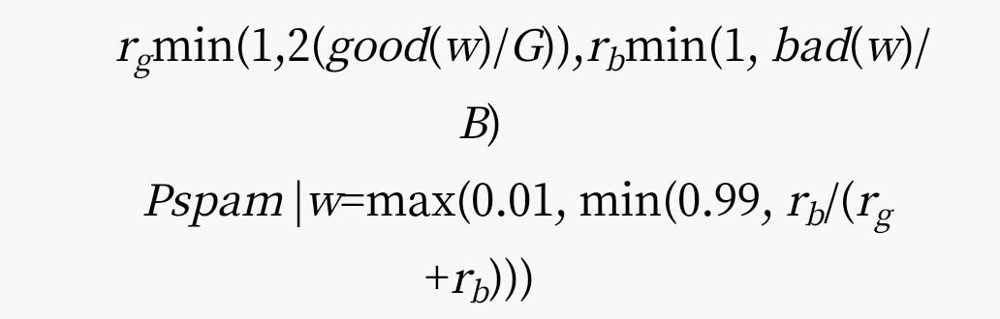
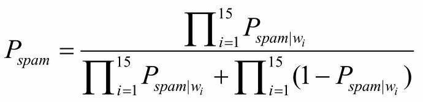

# 第 8 章 防止垃圾邮件的一种方法

我认为过滤垃圾邮件是可以做到的，基于内容的过滤器将发挥作用。发送垃圾邮件的人有一个致命伤，那就是他们发送的邮件本身。他们有办法逃脱你搭建的其他壁垒（至少目前是这样），但是不管怎样，他们都必须把垃圾邮件发出去。如果我们能够写出可以从内容上识别出垃圾邮件的软件，那么他们就无法逃脱了。

收信人很容易识别哪些是垃圾邮件，哪些是正常邮件。如果你雇人用肉眼帮你清除垃圾邮件，这事情应该没有太大难度。那么我们怎么用软件自动模拟这个过程（假定不使用复杂的人工智能）？

我觉得只用一些很简单的算法就可以做到这一点。事实上，我发现只要对单个词语进行贝叶斯判断，就能很好地过滤大部分垃圾邮件。设置好贝叶斯过滤器（详见后文），1000 封垃圾邮件能够被过滤掉 995 封，并且没有一个误判。

开发垃圾邮件过滤器时，统计学方法往往不是程序员首先想到的方法。大多数黑客的直觉是写出一个能够识别垃圾邮件某种特征的软件。你看着那些垃圾邮件，心想这些可恶至极的家伙胆敢向我发送以“亲爱的朋友”开头的邮件，或者主题行都是大写字母且以八个惊叹号作为结尾的邮件，我用一行代码就能把它们全过滤掉。

你这样做了以后，一开始效果还不错。几条简单的规则就能拦截大部分垃圾邮件。仅仅搜索单词 Click 就会捕捉到 79.7%的垃圾邮件（以我的情况为例），其中只有 1.2%是误判。

在转向统计学方法之前，大约整整有六个月，我一直使用这种特征过滤法，自己编写软件，识别垃圾邮件的特钲。我发现，到后来要想把识别精度提高几个百分点非常困难，如果我把过滤条件设置得很严格，误判率就会上升。

所谓误判，指的是正常的邮件被错误认定为垃圾邮件。对于大多数用户来说，错过一封正常的邮件后果要比收到垃圾邮件严重得多。所以，如果过滤器有误判，就好像治疗粉刺的药物却有致人死亡的危险一样。

用户收到的垃圾邮件越多，他就越不可能注意到被过滤掉的垃圾邮件中包含着一封正常邮件。这就导致了一个很奇怪的后果，如果你的过滤器效果越好，就越不能出现误判，一旦误判，后果就会变得很严重，因为过滤器工作得非常良好，所以用户相信它，就不太可能去检查被它过滤掉的邮件。

我不知道为什么我没有早一点尝试统计学方法。原因可能是我太过迷恋于发现垃圾邮件的特征，有一种与发送者斗智斗勇的感觉。（大多数黑客都是好胜心很强的人，一般人往往意识不到这点。）当我尝试统计学方法以后，我立刻发现这是更聪明的选择。它不仅能发现普通的垃圾邮件标志（比如，木马和广告性词语），还能发现像 per、FL、ff0000 这种不太明显的标志。事实上，ff0000 （HTML 语言中表示鲜红色的代码）被证明效果显著，能很有效地识别垃圾邮件，就像色情词汇一样容易辨别。

下面我就简单介绍一下我是如何开发统计学过滤器的。开始前，我先准备好一组垃圾邮件和一组非垃圾邮件，每组各有 4000 个样本。我对每一封邮件的全部内容进行了扫描，包括邮件头、内嵌的 HTML 代码和 JavaScript 代码。我把字母、阿拉伯数字、破折号、撇号、美元符号作为“实义标识”（token），所有其他字符则是“实义标识”的分隔符。（这个处理可能还可以进一步改善。）我忽略了完全由数字组成的字符串以及 HTML 注释，也不把它们当作“实义标识”的分隔符看待。

我计算了每个实义标识在两个邮件组出现的次数（忽略大小写）。完成这步以后，我就得到了两大张散列表，一个邮件组一张，表中每一栏就是一个键值对，“键”栏对应每一个实义标识，“值”栏则是这个标识出现的次数。

接着，我创建了第三张散列表，“键”栏还是每一个实义标识，“值”栏则是包含该标识的邮件是垃圾邮件的概率。我把这个概率记作 Pspam|w，计算公式如下：

<div style="margin: 0 auto; width: 50%;">
    
</div>

公式中的 w 就是我用来计算概率的那个实义标识，good 和 bad 表示我在第一步创建的两张散列表，G 和 B 分别表示正常邮件和垃圾邮件的数量。

为了避免误判，我稍微加大了某个实义标识不是垃圾邮件的概率。经过反复试错，我发现将 good 表的次数值全部增大一倍可以很好地达到这个目的。这有助于区分那些偶尔出现在正常邮件中的词以及那些几乎从不出现的词。我只把出现总次数超过 5 次的词列入计算范围（实际上，由于正常邮件会反复使用同样的词，所以出现总次数超过 3 次应该就够了）。下一个问题就是，如果一个词只出现在一组邮件中，它的概率应该怎么分配。我又通过试错法选择了 0.01 和 0.99。这里可能还有改善的余地，但是随着邮件数量的增加，计算结果应该会自动调整的。

那些善于观察的人会注意到为了计算每个词出现的次数，我把每一组邮件看成一整串文本流，但却还是使用电子邮件的数量而不是文本流的总长度作为计算概率时的分母。这样做也是为了加大不是垃圾邮件的概率，防止出现误判。

当收到新邮件的时候，程序会自动扫描，读出邮件中所有的实义标识，再找出其中 15 个最醒目标识（所谓“最醒目标识”，就是指概率偏离中性值 0.5 最远的标识），用它们判断整封邮件是垃圾邮件的概率。如果用 w1, …, w15 分别表示 15 个最醒目标识，那么计算整封邮件概率的公式如下：

<div style="margin: 0 auto; width: 50%;">
    
</div>

实践中遇到的问题是，如果出现一个以前从来没见过的词（即两张散列表里都找不到这个词），它的概率应该怎么计算。我发现（还是通过试错法）将概率设为 0.4 效果很好。如果你从来没见过这个词，它多半是一个正常的词，垃圾邮件用的词都是很常见的。

如果上面的公式计算出来的概率大于 0.9，我就把这封邮件当作垃圾邮件。但是在实践中，把这个门槛值设为多少并不是很重要，因为计算出来的概率值大多数都分布在两端，很少落在中间。

统计学方法的一大优点就是，你不需要一封封去看垃圾邮件。在使用它之前的六个月，我大概看了足足几千封垃圾邮件，这真是很苦恼的一件事。数学家 Norbert Wiener 说，如果你与奴隶比赛，你也会变成一个奴隶。与垃圾邮件搏斗就有这种令人退化的效果。为了识别垃圾邮件的每一个特征，你不得不钻进发送者的脑袋，搞清楚他们怎么想。说实话，我一刻都不想待在那里。

但是，贝叶斯方法的真正优点在于你知道你正在计算的是什么东西。识别垃圾邮件特征的过滤器（比如 SpamAssassin）为每封邮件计算一个“得分”，而贝叶斯方法为每封邮件算出一个概率。“得分”方法的缺点在于没人知道这个分数到底是什么意思，用户不知道，更糟的是，就连过滤器的开发者也不知道。如果邮件中有 sex（性）这个词，请问得分是多少？计算概率当然也会出错，但是至少意义上很清楚，一点也不模糊，而且用来计算它的那些依据也很清楚。根据我的邮件库，一封邮件中含有 sex 这个词，那么它有 0.97 的概率是一封垃圾邮件；要是含有 sexy 这个词，垃圾邮件的概率更是上升到 0.99。贝叶斯规则同样毫不含糊地表明，如果一封邮件同时含有这两个词，即使没有其他证据（事实上，这是不可能的），垃圾邮件的概率也将达到 99.97%。

因为贝叶斯方法计算的是概率，所以它必须考虑邮件中所有的线索，不管是肯定性线索还是否定性线索。有些词（比如 though、tonight、apparently）极少出现在垃圾邮件中，所以它们会大大降低这封邮件属于垃圾邮件的概率；同样，还有一些词（比如 unsubscribe、opt-in）几乎是垃圾邮件专用，它们会大大增加概率。因此，如果一封邮件的其他方面都合格，只是碰巧包含了 sex 这个词，这封邮件是不会被归入垃圾邮件的。

理想情况下，每个收信人应该都有自己单独的概率分布表。以我为例，我收到的许多邮件中都含有 Lisp 这个词，而迄今还没有垃圾邮件包含这个词。所以，一个这样的词实际上就像许可证一样，保证了这封信是发送给我的正常邮件。在我以前写的垃圾邮件过滤器中，用户可以自己开出一张清单，列出一系列这样的词。然后，收到的邮件之中如果包含这些词，就将自动通过过滤器。我自已的清单上除了 Lisp 这个词，还有我的邮政编码，所以网上购物的确认邮件就能安然通过过滤器（否则它们看上去很像垃圾邮件）。我当时觉得自己真是聪明绝顶，但是后来发现贝叶斯方法能够自动做到这一点，而且它还能发现许多我以前根本没意识到的这一类词语。

我在文章的开头说，我的过滤器现在可以在 1000 封垃圾邮件中正确识别出 995 封，并且没有一个误判。做到这一点的前提是必须有一个很大的邮件库作为判断依据。但是，我不想用这些数字误导读者，如果你想同样做到这个水平，最好采用我提倡的方法，就是把自己收到的所有邮件分成垃圾邮件和非垃圾邮件两大类。按照我的想法，每个用户应该有两个“删除”按钮，一个是“正常刪除”，还有一个是“垃圾邮件删除”。任何被后一个按钮删除的邮件都进入垃圾邮件库，而其他的所有邮件进入非垃圾邮件库。

刚开始的时候可以有一个所有人共享的基本概率分布表，但是到了最后，每个用户应该都分别有自己的概率分布表，这是根据他收到的邮件对每一个词进行统计后得出的。这样做可以：（a）使得过滤器更有效；（b）让每个用户自己定义，什么是他眼中的垃圾邮件；（c）使得垃圾邮件的发送者无法针对过滤器做出调整（这可能是最大的好处）。如果每个用户的过滤器大部分都是基于独立的数据库，那么每个过滤器的过滤条件都不一样，而且会更加富有成效。要是垃圾邮件的发送者仅仅针对基本概率分布表做出调整，并不能保证这封邮件会通过拦截。

统计学过滤器除了基于内容做出判断以外，还可以有一张白名单，上面列出值得信任的、不会发送垃圾邮件的发信人，让他们的邮件直接通过过滤器。建立这样一张白名单有一个容易的方法，就是将所有你曾经去信的地址都保留下来。另外，凡是你使用“正常删除”按钮删除的邮件（前提是邮箱软件必须同时具备“Spam 删除”按钮），它们的地址也可以加入白名单。

我提倡使用白名单，主要是为了节约计算，而不是认为这样可以改进过滤器的效果。我曾经认为白名单会让过滤器运作得更顺利，因为你从此只需要扫描那些陌生人的邮件就行了。试想一下，如果某人是第一次发邮件给你，他一般囿于常规，只会说一些需要对你说的内容，不会一上来就跟你讨论 sex。相反，倒是你已经认识的熟人可能会这样做。所以，白名单有助于避免这些邮件的误判。但是问题是，人们一般都有好几个 Email 地址，一封从陌生地址发来的邮件并不必然意味着来自一个你不认识的陌生人。一个老朋友突然用一个全新的地址写信给你可不是罕见情况，对于黑客尤其如此。所以，白名单并不会降低误判的风险。

不过，某种意义上，统计学过滤器其实内嵌了白名单（还有黑名单）。因为整封邮件都会被扫描，包括邮件头在内，所以经过这一步，过滤器自己“知道”哪些邮箱地址可以信赖（甚至还知道哪些中转的服务器可以信赖）。对于垃圾邮件，它也会“知道”得一清二楚，包括服务器名称、发送邮件的软件版本和邮件协议。

如果现在的过滤水平（1000 封垃圾邮件识别出 995 封）可以保持下去，我会觉得问题已经解决了。但是，垃圾邮件永远在进化，现在能够过滤它们不等于永远能够过滤它们。说实话，如今的大多数垃圾邮件过滤器就像杀虫剂一样，唯一作用就是创造出杀不死的新品种害虫。

我对贝叶斯方法寄予厚望，因为它的过滤能力可以随着垃圾邮件一起进化。所以，假定垃圾邮件发送者开始用 vlagra 替代 viagra，以此逃避某些机械的、基于单个词汇的过滤器的栏截，贝叶斯过滤器却能够自动注意到这种变化。实际上，vlagra 是比 viagra 确定性高得多的线索，可以证实这封邮件为垃圾邮件，至于概率到底高出多少，贝叶斯过滤器将准确告诉我们。

到目前为止还存在一个问题，所有垃圾邮件过滤器的开发者必须回答：如果发送人准确知道你的过滤机制，他们逃避拦截的可能性有多大？比如我猜想，如果“校验码”（checksum）方法对垃圾邮件构成重大威胁，那么发送人就会耍花招，使用同义词替代的技巧让每一封邮件内容完全不同，从而逃避拦截。

但是，要想骗过贝叶斯过滤器就没那么容易了。你把每一封垃圾邮件都写得独一无二或者不使用某些特定的标志性词汇，都不足以达到目的。只有让垃圾邮件看上去与正常邮件毫无区别才能够实现。我觉得要做到这一点真是够难为他们的。垃圾邮件主要用于销售目的，那么除非你正常往来的邮件都是销售类邮件，否则垃圾邮件不可避免地将与其他邮件不一样。此外，发送人还必须改变（并且不断改变）他的邮件系统架构，否则贝叶斯过滤器会识别出他的邮件头，而根本不用看邮件内容到底写的是什么。我对邮件系统架构知道得不多，不太清楚让邮件头逃过拦截的难度有多高，但是我猜想它的难度要超过让邮件正文逃过拦截的难度。

假定那些人连邮件头的难题也解决了，那么未来的垃圾邮件可能就是下面这个样子：

```
嗨，你好。请查看链接：
www.27meg.com/foo
```

这差不多就是统计学过滤器能够允许通过的销售类邮件的样子，最多就到这样了。（可是实际上，这段话更难逃过拦截，因为邮件的其他内容全部都是中性词语，垃圾邮件可能不得不在 URL 上做文章，但是要让一个 URL 看上去没有可疑之处还是很伤脑筋的。）

发送垃圾邮件的人形形色色。有的是公司，经营着一个所谓的邮件列表，表面上说你可以选择订阅，但是实际上根本无法退订，他们肆无忌惮地向你发送广告，有的是个人，专门劫持邮件服务器，推广色情网站。如果我们的过滤器迫使他们只能把垃圾邮件写成上面那样，应该会使得垃圾邮件业中合法经营的那部分人退出这个行业。因为他们很乐于遵守各州的法律规定，在邮件中附上正式声明，解释为什么自己不是垃圾邮件以及如何才能取消订阅。这一类文字反而使得识别他们变得更容易了。

（我以前曾经认为，那些相信更严格的法律会遏制垃圾邮件的人真是太天真了。我现在认为，更严格的法律或许无法减少我们收到的垃圾邮件的数量，但是肯定有助于减少逃过过滤器拦截的垃圾邮件的数量。）

在垃圾邮件业中，如果发送销售类垃圾邮件受到限制，那么整个行业将不可避免地受到重创。“行业”这个词是很准确的，发送垃圾邮件的人其实都是商人，他们这么做只是因为这招很有效。虽然垃圾邮件的回应率低到不能再低了（不超过百万分之 15，相比之下，传统的邮寄商品目录的回应率是百万分之 3000），但是发送垃圾邮件的成本实际上为零，所以它还是有效的。但是对于收到垃圾邮件的人来说，成本却很高昂，假定有 100 万人分别收到一封垃圾邮件，每人花一秒钟删除，累计起来就相当于一个人 5 个星期的工作量，而发送人连一分钱也不用付出。

不过，虽然接近于零，发送垃圾邮件还是有成本的。所以，只要我们把垃圾邮件的回应率降得很低（不管手段是直接过滤，还是让垃圾邮件被迫掩盖它们的销售意图），商家就会发现，发送垃圾邮件是一件经济上不值得的事情。

另一方面，垃圾邮件使用了那么多推销语言就是为了增加回应率。如果有一天推销语言突然不能用了，对他们就是重大打击。为了说明这一点，让我们把自己想象成一个回应垃圾邮件的人，看看这些人到底是怎么想的（这要比把自己想象成垃圾邮件发送者更让人难受）。回应垃圾邮件的人要么是惊人地轻信，要么是表面上完全否认、但是私底下却有着对性的强烈兴趣。不管哪一种情况，也不管垃圾邮件在正常人看来是多么令人反感或愚蠢万分，总是可以让这些人兴奋不已，因为邮件内容写得实在太诱人了，毕竟如果不是这样，商家也就不发送垃圾邮件了。要是邮件内容改成“请点击下面的链接”，对于收信人来说就没有太大的吸引力了，根本比不上现在的效果。结果就是，如果垃圾邮件不能使用诱人的推销语言，它作为推销工具的价值就会大大降低，使用它的商家数量也会减少。

最终，我们将取得全胜。我开始写垃圾邮件过滤器只是因为不想再让这些东西烦我了。但是，如果我们把过滤器做得足够好，那么垃圾邮件将不再有效，商家最后将不再发送它。

在所有对抗垃圾邮件的方法之中（从软件方法到法律方法），我认为单独来看，“贝叶斯过滤”是最有效的工具。但是，我也认为，我们使用的不同方法越多，综合效果就越好，因为任何对发送人构成限制的方法往往都会使得过滤器工作起来更顺利。即使同样是基于内容的过滤器，我也认为，如果有多种不同的软件可以同时使用会比较好。过滤器的差异越大，垃圾邮件想要逃过拦截就越不可能。
