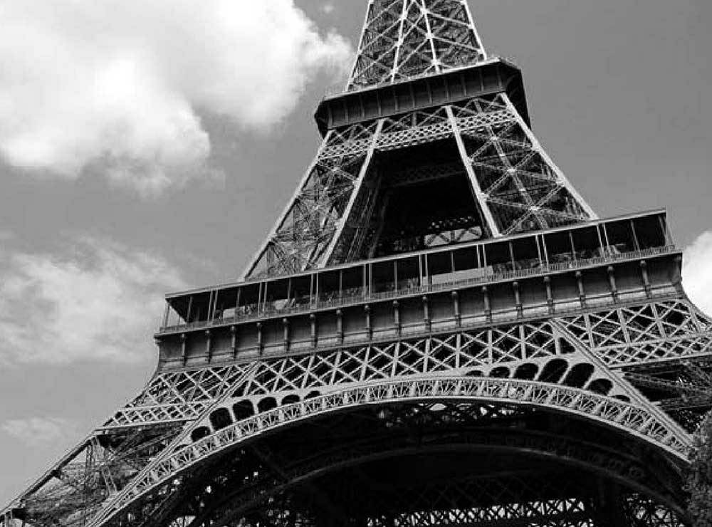
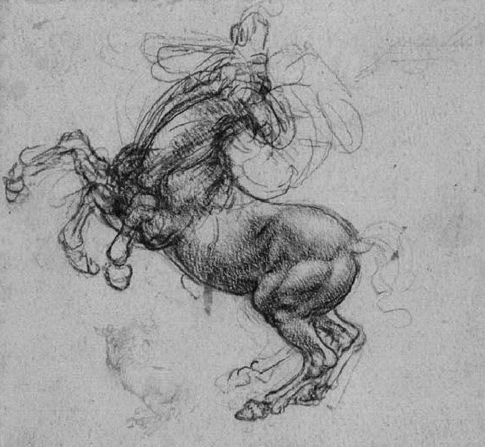
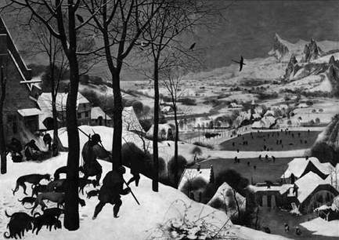

# 第 9 章 设计者的品味

> 哥白尼不认同托勒密的体系，一个极其重要的原因是，他觉得托勒密提出的偏心等距点（equant）毫无美感……
>
> ——托马斯·库恩，《哥白尼革命》
>
> 我们所有人都受到凯利·约翰逊的影响，狂热地相信外观优美的飞机一定会飞得同样漂亮。
>
> ——本·里奇，《臭鼬计划》
>
> 美感是第一道关卡，丑陋的数学在世界上无法生存。
>
> ——GH.哈代，《一个数学家的道歉》

最近，我与一个在 MIT 教书的朋友交谈。他的研究领域很热门，每年申请他的研究生的人多得让他应付不过来。“很多人看上去很聪明，”他说，“但是我不知道他们的品味如何。”

品味。如今很少听到这个词了，人们往往使用别的叫法，伹它却的的确确是我们离不开的基本槪念。我的朋友的意思是，他想要的学生不仅应该技术过硬，还应当能够使用技术做出优美的产品。

数学家会把出色的工作称赞为“优美的”。无论古今，科学家、工程师、音乐家、建筑师、设计师、作家、画家都是这样做的，他们都使用同一个词。这仅仅是巧合吗，还是他们之间有共识？如果真的有共识，那么我们能不能将某一个领域发现的“美”的规律运用于另一个领域呢？

对于我们设计师来说，美就不仅仅是一个理论问题了。如果世界上真有“美”存在，我们需要能够认出它。设计产品时，我们需要良好的品味。与其把“美”说成一个虚无缥缈的抽象概念，还不如让我们考虑一个实际的问题（这样就能避免喋喋不休的空谈）：如何才能做出优美的产品？

如果你在当今社会提到“品味”，很多人会对你说“品味是主观的”。他们真的就是这么认为的。喜欢一件东西，却不知道为什么自己喜欢它，原因可能是这件东西是美的，但也可能因为他们的母亲也拥有同样的东西，或者杂志上某个明星使用它，或者仅仅因为它的价格很昂贵。人类的思想就是没有经过整理的无数杂念的混合。

我们大多数人从孩提时代起就被鼓励不要去分析清楚自己的头脑。如果你的小弟弟画图时把人都涂成绿色，你想取笑他，你妈妈很可能会对你说：“你有你喜欢的方式，他有他喜欢的方式。”

你妈妈这时不是教给你什么是美学，而只是想阻止你们两个争吵。

就像大人哄小孩的其他话一样，这句话也是模棱两可的，与其他话会发生冲突。大人教导你说品味只是每个人的偏好而已。但是来到博物馆，他们却对你说，仔细观赏达·芬奇的作品，因为他是伟大的艺术家，品味超凡。

小孩子受到这样的教导会怎么想？他会怎么理解“伟大的艺术家”？这么多年来，别人无数遍地告诉他，品味就是一种偏好，是每个人自己的事情，所以他不可能直接就明白，所谓“伟大的艺术家”就是这个人的作品要比其他人的杰出。他更可能觉得，所谓“伟大的艺术家”只是针对我个人世界而言的，就是很符合我自己口味的艺术家，好比某本书上说食用西兰花对我的健康有利，所以我就应该喜欢吃西兰花一样。

把品味说成个人的偏好可以有效地杜绝争论，防止人们争执哪一种品味更好。但是问题是，这种说法是不正确的。只要你自己开始动手设计东西，就能明白这一点。

不管每个人的工作是什么，他们内心里都有一种愿望——把自己的工作做好。足球运动员想羸得比赛，CEO 想增加利润。做好自己的工作会真正令人感到自豪和偷快。但是，如果你是一个设计师，并且你不承认有一种人们共同认可的东西叫做“美”，那么你就没有办法做好工作。如果品味只是一种个人偏好，那么每个人都是完美无缺的：你喜欢自己看上的东西，那就足够了。

就像别的工作一样，只要你不断地从事设计工作，你就会做得越来越好。你的品味会出现变化，你会像别人一样有所提高。如果这样的话，那么你以前的品味就不只是与现在不同，而是不如现在的好。因此，所谓的“品味没有好坏之分”的公理也就顿时见鬼去了。

现在流行“相对主义”，即认为真理是相对的。即使你已经从小孩变成了成年人，这种观点依然可能妨碍你思考“品味”。但是，只要你走出狭隘的自我，至少在心里对自己说，确实存在比其他设计更好的杰出设计，那么你就能开始仔细研究了。你的品味是如何变化的？什么原因使你做出不好的设计？其他人对设计是什么观点？

只要你开始思考这些问题，你就会发现，众多不同学科对“美”的认识有着惊人的相似度。优秀设计的原则是许多学科的共同原则，一再反复地出现。

`好设计是简单的设计。`从数学领域到绘画领域，你都可以听到这种说法。在数学中，它表示简短的证明往往是更好的证明。特别是对于数学公理来说，少即是多。在编程中，这种说法也基本适用。对于建筑师和设计者，它意味着美依赖于一些精心选择的结构性元素，而不依赖于表面装饰品的堆砌。（装饰品本身并不是坏事，只有当它被用来掩盖结构的苍白时，才变成了一件坏事。）绘画也是类似的，认真观察的、非常有代表性的静物作品往往要比表面极尽华美、但是实质上只是无意义重复的“巨作”（比如再现非常复杂的花边的绘画作品）更有价值。在写作上，这种说法意味着只说必须要说的话，并且说得简短。

这样强调简单似乎有点奇怪。有人会说，简单就是事物本来的样子，装饰反而意味着更多的工作。但是，当人们自己从事创造性工作的时候，好像就会忘了保持简单这个原则。刚开始写作的人喜欢用浮夸的语调，根本不像他们平时说话的样子。设计师喜欢用波浪式卷曲表现他们的艺术感。画家发现自己都是表现主义者（expressionist）。这些装饰都是花架子，在作家的长句、画家“表现主义”的画笔之下，根本就是空洞无物，表面的装饰掩盖了内部的空虚，太可怕了。

当你被迫把东西做得很简单时，你就被迫直接面对真正的问题。当你不能用表面的装饰交差时，你就不得不做好真正的本质部分。

`好设计是永不过时的设计。`只要没有错误，每一个数学证明都是永不过时的。所以，数学家哈代才会说：“丑陋的数学在世界上无法生存。”他的意思与飞机设计师凯利·约翰逊的观点是一样的：如果解决方法是丑陋的，那就肯定还有更好的解决方法，只是还没有发现而已。

以永不过时作为目标是一种帮助自己找到最佳答案的方法：如果你不愿别人的答案取代你的答案，你就只好自己做出最佳答案。某些大师的作品太过杰出，永不过时，使得后人几乎难以在该领域立足。自从 16 世纪出现了德国雕刻大师丟勒（Dürer），后世的雕刻家都因为自己的作品被拿来与他的作品作比较而苦不堪言。

以永不过时作为目标也是一种避开时代风潮的影响的方法。“风潮”这个词，从字面上就可以看出，它就是一阵风似的，随着时间经常改变。如果一件东西长盛不衰，那么它的吸引力一定来自本身的魅力，而不是来自风潮的影响。

说来奇怪，如果你希望自己的作品对未来的人们有吸引力，方法之一就是让你的作品对上几代人有吸引力。我们很难猜想未来是什么样子，但是可以肯定，未来的人们不会在乎今天流行的风潮，这一点与上几代人是相同的。所以，如果你的作品对今天的人们以及 1500 年的人都有吸引力，那么它极有可能也会吸引 2500 年的人。

`好设计是解决主要问题的设计。`厨房的煤气灶有四个出火口，排成一个正方形。每个出火口都由一个调节器控制，四个出火口就有四个调节器。请问应该如何摆放调节器？最简单的摆放方法当然是把四个调节器排成一列，但要是这样做，人们使用起来就很不方便，每次都要停下来想一下到底每个调节器对应的是哪个出火口。如果直接把调节器排成与出火口一样的正方形，就不会有这个问题了。

许多坏设计做得很辛苦，但是从一开始方向就错了。20 世纪中期，有一股使用无衬线（sans-serif）字体的潮流。这一类字体接近于纯手写的样式，但是它无助于解决最主要的问题。印刷出来的文字首先应该是易于辨认的，所以能够清晰地分辨字母就是最主要的问题——传统的新罗马（Times Roman）字体是一种有衬线的字体，虽然看上去古老得就像维多利亚女王时代的风格，但是它的小写 g 就是可以很轻易地与小写 y 区分。

答案可以不断改进，同样，问题本身也可以不断改进。软件的难题通常可以被改成等价的较易解决的形式。历史上，物理学的主要难题曾经一度是如何诠释经典著作，后来遂渐变成对可观测到的行为进行预测，这种转变使得物理学的发展速度大大加快。

`好设计是启发性的设计。`英国女作家简·奥斯汀的作品几乎不带有任何描述。她不告诉读者每件东西看上去是什么样子，只是把故事讲得非常生动，让读者自己把一切都想象出来。同样，绘画作品也分为描述性绘画和启发性绘画，后者往往比前者更引人入胜。每个人看到《蒙娜丽莎》都有自己的理解。

在建筑学和设计学中，这条原则意味着，一幢建筑或一个物品应该允许你按照自己的愿望来使用。举例来说，一幢好的建筑物应该可以充当平台，让你想怎么布置就可以怎么布置，过上自己想过的家庭生活，而不是使得你像执行程序一样只能过上建筑师为你安排的生活。

在软件业中，这条原则意味着，你应该为用户提供一些基本模块，使得他们可以随心所欲自由组合，就像玩乐高积木那样。在数学中，这条原则意味着，一个可以成为许多新工作基础的证明要优于一个难度很高、但无助于未来学科发展的证明。在科学领域中，总体上可以把引用次数看作对他人启发性大小的粗略指标。

`好设计通常是有点趣味性的设计。`这条原则可能不是所有情况下都成立。但是，丢勒的雕刻、芬兰设计师沙里宁（Saarinen）的子宫椅（Womb Chair）、意大利罗马的万神殿（Pantheon）、保时捷 911 型汽车的原型设计（图 9-1），在我看来都很有趣。逻辑学家哥德尔（Gödel）的不完备定理就好像一个玩笑那样有意思。

    

图9-1 保时捷911E，1973年产

我想，这是因为幽默一定程度上反映了力量。幽默感是强壮的一种表现，始终拥有幽默感就代表你对厄运一笑了之，而丧失幽默感则表示你被厄运深深伤到。所以，强壮的标志（或者至少是特点）就是轻松面对自己的人生。充满自信的人常常像燕子一样，以一种居高临下的姿态轻盈地看待周围的一切，比如希区柯克拍摄的电影、16 世纪画家勃鲁盖尔（Bruegel）的绘画（甚至莎士比亚也是一个这方面的例子）。

好的设计并非一定要有趣，但是很难想象完全无趣的设计会是好的设计。

`好设计是艰苦的设计。`如果观察那些做出伟大作品的人，你会发现他们的共同点就是工作得非常艰苦。如果你工作得不艰苦，你可能正在浪费时间。

困难的问题需要艰巨的付出才能解决，高难度的数学证明需要结构非常精细的解决方法（它们往往做起来很有趣），工程学也是如此。

当你攀登高山时，必须扔掉一切不必要的装备。在困难地点或预算不足的条件下，建筑师就只能做出很简练的设计。当解决难题成为压倒一切的任务时，那些流行样式与华丽装饰就被抛到一边去了。

并非所有的痛苦都是有益的。世界上有有益的痛苦，也有无益的痛苦。你需要的是咬牙向前沖刺的痛苦，而不是脚被钉子扎破的痛苦。解决难题的痛苦对设计师有好处，但是对付挑剔的客户的痛苦或者对付质量低劣的建材的痛苦就是另外一回事了。

在绘画上，肖像画通常占据最高地位。这不是偶然的，原因不仅是面部肖像比其他题材更能打动人，还因为我们太擅长观察脸，所以肖像画家不得不加倍努力才能达到我们的要求。如果画的是树，树枝画偏了五度也不会有人发现。但是，如果你把别人的眼睛画偏了五度，人们一眼就能看出来。

德国包豪斯（Bauhaus）学派的设计师采纳了美国建筑师路易斯·沙利文（Louis Sullivan）的观点“功能决定形式”（form follows function），但是他们实际上的理解是“功能应当决定形式”。真实情况是，如果开发“功能”非常艰难，那么“形式”将不得不全部都由“功能”决定，因为没有多余的精力再来单独开发“形式”了。人们常常觉得野生动物非常优美，原因就是它们的生活非常艰苦，在外形上不可能有多余的部分了。

`好设计是看似容易的设计。`优秀运动员比赛时，让人觉得他轻轻松松就获胜了，优秀设计师也是如此，他们的工作看上去很容易。大多数时候，这是一种错觉。作家的文章读起来流畅自如，但是背后其实经过了反复修改。

科学和工程学的一些最重大的发现在形式上往往很简单，会使得你觉得自己也想到过。可是，如果它真的那么简单，为什么发现人不是你呢？

达·芬奇的有些肖像画只是几根线条。看着它们，你会想只要把这十根八根线条放对位置，你也能画出如此优美的肖像画。说的没错，可是难就难在找出正确的位置。只要位置偏移一点点，整幅作品就会一溃千里。

白描其实是最难画的视觉媒介，因为它们要求几近完美的再现。用数学语言说，线条属于闭合解（closed-form solution），水平不够的艺术家没有办法直接解决问题，只能通过不断逼近来求解。许多孩子在十岁左右放弃了绘画，原因之一就是这时他们开始学习成年人的绘画技法，首先练习用线条勾勒出人脸。

在大多数领域，看上去容易的事情，背后都需要大量的练习。练习的作用也许是训练你把刻意为之的事情变成一种自觉的行为。有时，我们的训练只是为了让身体养成下意识的反应。优秀钢琴家弹奏名曲可以不经过大脑直接完成，艺术家也是这样，熟练以后，脑海中的艺术形象会自动从手上流淌出来，仿佛有人在一旁为他打节奏一样。

人们有时会说自己有了“状态”，我的理解是，他们这时可以控制自己的脊髓。脊髓是更本能的反应，面对难题时，它能释放你的直觉。

`好设计是对称的设计。`对称也许只是简洁性的一种表现，但是它十分重要，值得单独列为一点。自然界的对称大量存在，这就说明了对称的重要性。

对称有两种：重复性对称和递归性对称。递归性对称就是指子元素的重复，比如树叶上叶脉的纹路。

历史上，对称曾经泛滥一时，导致现在它在某些领域已经不流行了。从维多利亚女王时代开始，建筑师就有意多建造不对称的建筑。20 世纪 20 年代，不对称成了现代主义建筑的一个明确的前提条件。但是即使如此，这些建筑物往往也只是在主轴上不对称，细节部分依然大量使用对称。

在写作中，你会发现对称无处不在，短语、句子、小说的情节都是如此。音乐和美术也大量使用对称。拼接式的美术作品（还有塞尚的一部分作品）有非常强烈的视觉感染力，原因就是整幅作品由相同的作图元素构成，这也属于对称。对称性构图产生了一些最让人难忘的绘画作品，尤其是那些两个半边互相呼应的作品，比如米开朗基罗的壁画《创世纪》和格兰特·伍德的油画《美国式哥特》。

在数学和工程学中，递归尤其有用。归纳式证明方法既简洁又美妙。在软件中，能用递归解决的问题通常代表已经找到了最佳解法。巴黎的埃菲尔铁塔如此引人注目，部分原因就是它的外形是递归的，大塔上面还有小塔（图 9-2）。

    

图9-2 埃菲尔铁塔，1889。大塔上面有小塔

对称的危险在于它可以用来取代思考，在大量使用重复的时候这种危险性更大。

`好设计是模仿大自然的设计。`我不是说模仿大自然这种行为本身有多么好，而是说大自然在长期的演化中已经解决了很多设计问题。所以，如果你的设计与大自然很接近，那么它基本上不会很差。

模仿与剽窃并不相同。如果一部小说写得好像真实生活的再现，没人会提出异议。虽然写实的价值常常被误解，但它也是绘画的一个重要工具。写实的目的不是为了给生活留下一模一样的记录，而是为你的思想提供一个咀嚼点：你的眼睛看着某样东西，你的手就代表你的思想， 画出一些比较有意思的内容。

模仿大自然也是工程学的有效方法。长久以来，船只就像动物一样有龙骨和肋骨。不过，前提条件是技术水平要达到，只有这样才有可能模仿大自然。早期的飞机设计师按照鸟的形状设计飞机，这样做其实是错的，因为那时还没有足以模拟鸟类行为的轻型材料和能源，也做不出高度复杂的控制系统，所以飞机还不可能像鸟类那样飞。但是，我能想象五十年后，小型的无人侦察飞机可以做得完全像鸟一样。

现在的计算机已经很强大了，不仅能模拟出大自然的环境，还能模拟大自然发展演变的结果。遗传算法可能会创造出正常条件下难以设计的复杂事物。

    

图9-3 达·芬奇，《一匹直立的马的研究》，1481~1499

`好设计是一种再设计。`很少有人一次就把事情做对。专家的做法是先完成一个早期原型，然后提出修改计划，最后把早期原型扔掉。

扔掉早期原型是需要信心的，你必须有本事看出什么地方还可以改进。举例来说，刚刚开始学画的人往往不愿意重画画错的地方。他们觉得能画成现在这样已经很不错了，如果重画某些部分，结果可能还不如现在。所以，他们就说服自己，我的画已经过得去了，没准别人也会这么看。

这想法很危险。你应该培养对自己的不满。达·芬奇为了把一根线画对，经常要画五六次。保时捷 911 型汽车的原型很粗糙，只有在重新设计后它的背部轮廓才变成现在这样独特的曲线。建筑师莱特设计的古根海姆博物馆，最早的时候，右半边有点像古代的塔庙（ziggurat），他后来把它倒过来，就成了现在的样子。

犯错误是很正常的事情。你不要把犯错看成灾难，要勇于承认、勇于改正。达·芬奇实际上重新发明了素描这种艺术形式，把它当作一种探索更多可能的方式。开源软件因为公开承认自己会有 bug，反而使得代码的 bug 比较少。

做修改的时候，有一个合适的工具会使得改动更容易。美术史上，15 世纪油彩取代蛋彩（tempera）就是一个重大突破，油彩使得画家更方便地处理那些困难的主题（比如人体），因为油彩可以调制，还可以重画，蛋彩就做不到这些。

`好设计是能够复制的设计。`我们对待复制的态度经常是一个否定之否定的过程。刚入门的新手不知不觉地模仿他人，遂渐熟练之后才开始创作原创性作品。最后他会意识到，把事情做对比原创更重要。

不知不觉的模仿几乎必然将导致坏设计。如果你不知道自己的想法从何而来，那么你可能就是在模仿另一个模仿者。19 世纪中期，拉斐尔画派主导了整个画坛，几乎每个学画的人都在模仿拉斐尔，可是经常谬以千里。有一些艺术家实在看不下去了，被如此之多模仿拉斐尔的人搞烦了，于是成立了前拉斐尔画派。

等到你逐渐对一件事产生热情的时候，就不会满足于模仿了。你的品味就进入了第二阶段，开始自觉地进行原创。

我想，最伟大的大师最终会达到一种超脱自我的境界。他们一心想找到正确答案，如果别人已经回答出了一部分，那就没理由不拿来用。他们足够自信地使用他人的成果，完全不担心因此丧失个人的特点。

好设计常常是奇特的设计。某些最出色的作品堪称不可思议：欧拉公式、16 世纪画家勃鲁盖尔的《雪中猎人》（图 9-4）、SR-71“黑鸟”超音速侦察机（图 9-5）、计算机的 Lisp 语言等。它们不仅优美，而且美得很奇特。

    

图9-4 勃鲁盖尔的《雪中猎人》，1565年

    

图9-5　洛克希德公司的SR-71“黑鸟”超音速侦察机，1964年

我不太确定原因，可能是因为我不够聪明，才会觉得它们看上去很奇特。一条狗看到开罐器也会认为那是一个奇迹。如果我是天才的话，可能会觉得`e^iπ=-1`是再平常不过的事情，它又没有说错，有什么好奇怪的。

我在前文提到的好设计的大多数特点都是可以培育出来的，但是我觉得“奇特”这个特点是无法培育的。你最多就是在它开始显现时不要把它扼杀掉。爱因斯坦并不想让相对论变得很奇特，他只想找出真理，是真理本身显得很奇特。

我曾在一家美术学校学习绘画，那里的学生最想做的就是发展出一种自己的风格。但是，如果你想做出好作品，不可避免地会采用一种独特的方式，就好像每个人走路的姿势其实都不尽相同。米开朗基罗并没想过要树立米开朗基罗风格，他只是想画好作品，结果不由自主地创造出了米开朗基罗风格。

你最后发展出来的风格是自然而然形成的。“奇特”这个特点尤其如此，没有其他路可走。它就像连接大西洋和太平洋的“西北航道”，无数人希望找到这条捷径。16 世纪的风格主义者、19 世纪的浪漫主义者、一代代的美国高中生都在寻找，但就是找不到。唯一达到“奇特”的方法，就是追求做出好作品，完成之后再回过头看。

`好设计是成批出现的。`15 世纪住在佛罗伦萨的伟大艺术家有建筑师布鲁内莱斯基、画家吉贝尔蒂、雕塑家多纳泰洛、画家马萨乔、画家菲利普里皮、画家弗拉安吉利科、雕塑家韦罗基奥、画家波提切利、达•芬奇和米开朗基罗。当时，米兰也是同等的大城市，请问你能说出 15 世纪米兰城有什么伟大艺术家吗？

15 世纪的佛罗伦萨有一些独特的条件，它们是不可延续的，因为今天的佛罗伦萨已经不是如此了。我们还必须假设达•芬奇和米开朗基罗拥有的天赋，在米兰城里一定也有人拥有。那么为什么没有出现米兰的达•芬奇呢？

今天，生活在美国的人口大概是 15 世纪佛罗伦萨的一千倍。那么按照比例推算，在我们之中存在着一千个达•芬奇和一千个米开朗基罗。如果这种推算成立，我们应该每天都看到令人惊叹的艺术奇迹。但是，事实并非如此，原因就是达•芬奇的出现除了他本身的天赋以外，还有赖于 1450 年的佛罗伦萨。

推动人才成批涌现的最大因素就是，让有天赋的人聚在一起，共同解决某个难题。互相激励比天赋更重要，达•芬奇之所以成为达•芬奇，主要原因不仅仅是他的天赋，更重要的是他生活在当时的佛罗伦萨，而不是米兰。今天，人类生活的流动性高得多，但是伟大的项目依然不成比例地集中在少数几个热点上：德国包豪斯建筑学院、曼哈顿计划、《纽约人》杂志、洛克希德公司的臭鼬工作室、施乐公司的帕洛阿尔托研究中心。

在历史的任何时刻都有一些热点项目，一些团体在这些项目上做出伟大的成绩。如果你远离这些中心，几乎不可能单靠自己就取得伟大成果。某种程度上，你个人最多可以对趋势产生一定的影响，但是你不可能决定趋势，实际上是趋势决定了你。（或许有人办得到，但是米兰的达•芬奇显然没有办到。）

`好设计常常是大胆的设计。`在任何一段历史中，人们都会把某些荒谬的东西当作正确的，并且深信不疑，以至于一旦你出言质疑，就有被排挤或者被暴力伤害的危险。

我们自己的这个时代要是不同以往，当然令人欢欣鼓舞。但是就我所知，它并没有任何不同。

这个问题不仅存在于每个年代，还或多或少存在于每个领域。许多文艺复兴时期的艺术作品在当时都被认为极其大逆不道。根据意大利画家瓦萨里的记载, 波提切利因此向教会忏悔并且放弃绘画，巴尔托洛梅奥和洛伦索迪克雷迪则是把自己的作品烧掉。爱因斯坦的相对论触犯了许多同时代的物理学家，许多年后还没有被完全接受，法国物理学家直到 20 世纪 50 年代才接受相对论。

今天的实验性错误就是明天的新理论。如果你想做出伟大的新成果，那就不能对常识与真理不相吻合之处视而不见，反而应该特别注意才对。

实际上，我觉得发现丑陋的东西要比你想象出一个优美的东西更容易。大多数做出优美成果的人好像只是为了修正他们眼中丑陋的东西。伟大成果的出现常常来源于某人看到一样东西后，心想我能做得比这更好。拜占庭帝国的《圣母像》最早是根据某个公认的模板画的，非常机械呆板。几百年后的 14 世纪，意大利画家乔托看到以后，深感不满，决定动手改进，他因此成为文艺复兴的先行者。哥白尼对地心说无法解释的事情深感困扰，他的同时代人都觉得这可以忍受，他却认为一定能找到一种更好的解释。

单单是无法容忍丑陋的东西还不够，只有对这个领域非常熟悉，你才可能发现哪些地方可以动手改进。你必须锻炼自己。只有在成为某个领域的专家之后，你才会听到心里有一个细微的声音说：“这样解决太糟糕了！一定有更好的选择。”不要忽视这种声音，要培育它们。优秀作品的秘诀就是：非常严格的品味，再加上实现这种品味的能力。
